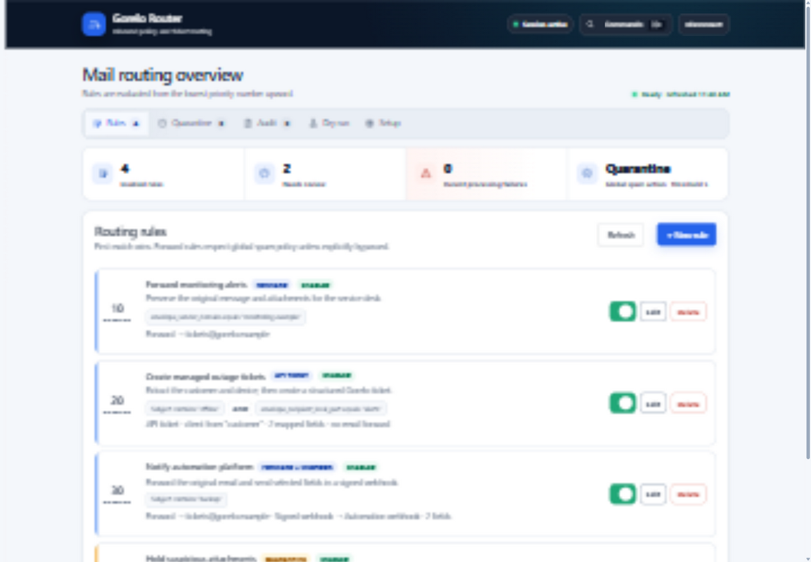
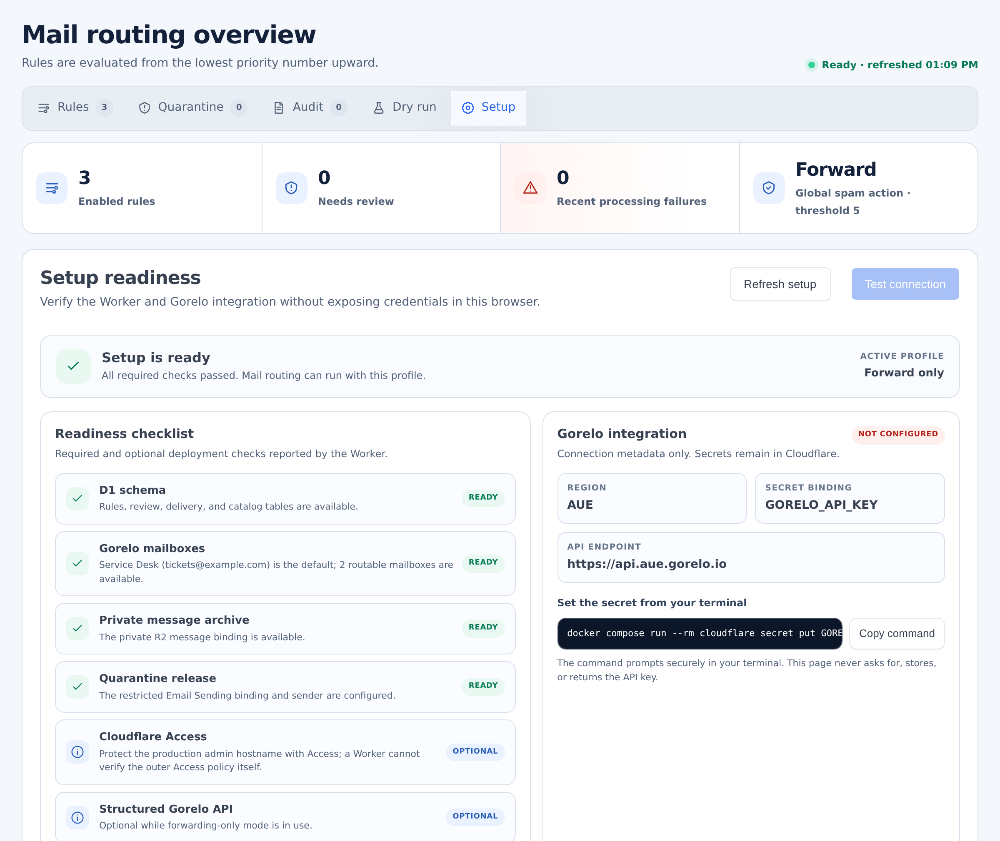
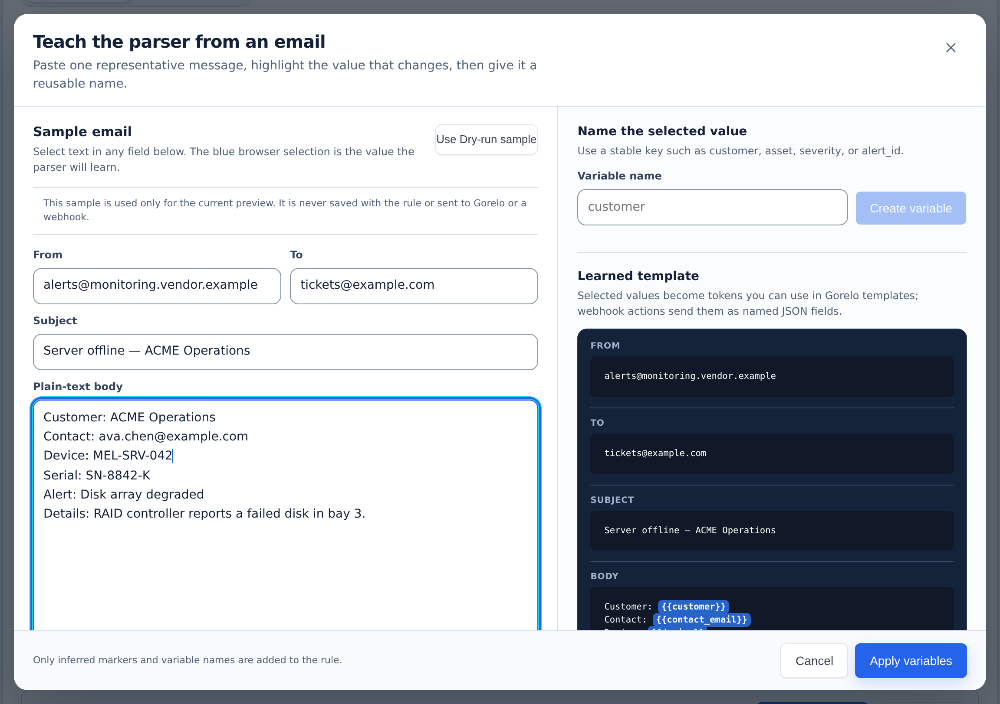

# Gorelo Router

A Docker-deployed Cloudflare Worker that routes email from one or more inbound domains and authenticated JSON webhooks into Gorelo, signed webhooks, or structured automation. Email forwarding remains the default and preserves the original message, attachments, sender, recipients, and threading; opt-in API-only routes trade those mail semantics for structured Gorelo ticket or alert fields.


The diagram is based on the running Gorelo Router dashboard with synthetic demo
data. Follow the **[end-user setup guide](docs/setup-guide.md)** for the Docker
trial, Cloudflare deployment, Gorelo connection, first rule, and production
security checks. The live interface captures below use an isolated Docker
dataset with reserved example addresses; none contains credentials or customer
data.

It includes:

- ordered D1 rules with `all`/`any` matching over envelope, header, size, body, attachment, and local spam-score facts;
- any number of Cloudflare Email Routing catch-all domains, with recipient-domain conditions inside the shared rule engine;
- forward, R2-backed internal hold, review-mailbox quarantine, drop, and SMTP-reject actions;
- named Gorelo mailboxes with one persistent default, stable rule references,
  domain-or-address destination authorization, and Cloudflare's independent
  verified-destination check;
- conservative subject-only spam scoring, initially configured for observation rather than blocking;
- a responsive [Tabler](https://tabler.io/admin-template)-based dashboard at `/admin` with Rules, Quarantine, Audit, Dry run, and Setup workspaces;
- bounded message audit detail in D1, optional raw RFC 5322 retention in private R2, and scheduled cleanup;
- versioned quarantine release/dismiss actions with an append-only review timeline;
- priority-aware MIME parsing only when a rule actually needs body or attachment facts;
- optional read-only Gorelo client import with any number of exact customer aliases, optional source scopes, and no fuzzy tenant guessing;
- Audit-driven and manually supplied sample teaching for literal field
  extraction, including a short-lived opt-in capture for the next matching
  message, with centrally registered HTTPS webhook destinations and HMAC
  signatures;
- opt-in native Gorelo ticket and alert creation from extracted values, fixed or
  alias-resolved clients, and exact dynamic ticket associations for contacts,
  technicians, and agent assets from current Gorelo catalogs;
- a durable outbound-delivery ledger with immutable attempt history, bounded webhook retries, and manual review for uncertain Gorelo creates;
- authenticated inbound JSON webhook sources with one-time revocable tokens,
  JSON Pointer mappings, idempotency, per-source rate limits, raw-payload
  minimization, and routes to audit, Gorelo ticket/alert templates, or signed
  outbound webhook destinations;
- unit and integration-style Worker tests, plus documented local D1 verification.

## Forwarding by default, structured API actions by choice

```text
Inbound email
     │
     ▼
Cloudflare Email Routing ──► Email Worker ──► D1 rules + audit
                                  │                  │
              ┌───────────────────┼──────────────────┬─────────────┐
              ▼                   ▼                  ▼             ▼
          reject/drop     internal R2 hold       forward original   API-only rule
                                  │                  │             │
                           review + release          ▼             ├─► R2 raw
                                  └──────────► Gorelo inbound      └─► Gorelo API
                                                     │               ticket/alert
                                        optional signed webhook
                                        (mapped variables + audit)
```

Forwarding is the primary feature because Gorelo's structured API does not accept raw MIME or attachments. Gorelo's native forwarding route preserves mail semantics and can apply configured group, client, tag, and user metadata; see Gorelo's [custom-domain and forwarding guide](https://help.gorelo.io/custom-domain).

Gorelo forwarding addresses often use a subdomain of the inbound domain (for
example, `helpdesk@gorelo.example.com`). Cloudflare blocks native Email Routing
forwards to any address in the same zone as the Worker, so production should
enable the separate Cloudflare Email Sending service and configure the
`RELEASE_EMAIL` binding plus `RELEASE_FROM_ADDRESS`. Same-zone Gorelo mail is
then submitted through Email Sending with the original MIME and attachments;
external destinations continue to use `message.forward()`.

Create several Gorelo forwarding addresses when different alert sources need
different metadata, then register them as named mailboxes in **Setup**. Exactly
one mailbox is the persistent default. A forwarding rule can deliberately
follow the current default or pin itself to a stable mailbox ID. If no rule
matches, non-spam mail follows the mailbox currently marked default. Changing
the default therefore affects unmatched mail and default-following rules, but
never repoints a rule pinned to a mailbox ID.

`DEFAULT_GORELO_ADDRESS` is used only to create the first registry mailbox and
make it the initial default. Its exact domain is implicitly authorized for
named mailboxes; add other exact domains to `ALLOWED_FORWARD_DOMAINS` when a
deployment uses more than one Gorelo forwarding domain. Domain matching does
not include subdomains. `ALLOWED_FORWARD_DESTINATIONS` remains an exact-address
override and is still required by legacy rules containing
`action.destination`. Every actual forwarding address must also be
independently verified as a Cloudflare Email Routing destination. Once the
registry exists, a later environment-variable change never silently rewrites
its persisted name, address, or default selection.

A `forward_webhook` rule keeps the original-message forward as its primary
external action. Before requesting the forward, the Worker atomically stores
the audit event and pending webhook snapshot; it sends the webhook only after
Cloudflare accepts the primary forward.

Use `create_ticket` or `create_alert` only when the extra field-level control is worth giving up the native mail representation. These API-only primary actions call Gorelo's documented `POST /v1/tickets` or `POST /v1/alerts/` endpoint and send the official PascalCase request fields instead of forwarding the inbound message. The Worker requires `MESSAGE_ARCHIVE`, retains the original RFC 5322 message privately, and records the request and attempt in the delivery audit. A definitive preflight/API failure may still use the explicitly configured failure route; an uncertain provider outcome never does. Gorelo authenticates API requests with a scoped `X-API-Key` at the selected regional endpoint; see the official [API overview and regional Swagger links](https://help.gorelo.io/api-overview).

A ticket can keep fixed contact, lead-assignee, and agent-asset IDs or resolve
each one from an extracted field. The client is always resolved first. Contacts
and agent assets must then match exactly inside that client; a lead technician
must match exactly in Gorelo's global organisation-user catalog. Missing,
ambiguous, stale, cross-client, incomplete-catalog, and upstream lookup outcomes
fail closed rather than guessing. Dry run and Audit show the exact entity and
ID selected. Alerts remain different: Gorelo's alert endpoint accepts a text
`Resource`, but it cannot attach contact or agent-asset IDs.

The required catalogs are cached in D1 for
`GORELO_CATALOG_CACHE_SECONDS`. Contact snapshots are fetched only for the
already resolved client; organisation users and agent assets use bounded global
snapshots. A fresh complete snapshot is reused, while refresh or expiry performs
a bounded live Gorelo read. The Router fails explicitly when a snapshot is
expired, incomplete, oversized, or cannot be cached safely, and it does not let
an older concurrent refresh overwrite newer catalog data.

`QUARANTINE_MODE` controls what a quarantine decision means:

- `internal` is a true hold. The Worker writes the original message to private R2, creates the D1 review item synchronously, and does not forward it. An administrator can inspect a safe text view, download the EML, dismiss it, or release it to an authorized named Gorelo mailbox.
- `mailbox` synchronously creates its audit event, then forwards to `QUARANTINE_ADDRESS` (or an explicit quarantine-rule destination). It is not an in-app hold; the mailbox owns review and release. `ARCHIVE_MODE=quarantine` or `all` can still retain an audit copy, but the dashboard deliberately does not present mailbox-mode items as releasable holds.

## Prerequisites

- Git, Docker Engine, and Docker Compose v2. Node.js and Wrangler run inside the supplied containers; do not install them on the host.
- A Cloudflare account with every receiving domain on Cloudflare DNS.
- A Gorelo ticketing forwarding address from **Settings → Email → Settings**.
- A scoped Gorelo API key when enabling client import/catalogs or API-only ticket/alert actions. Give it read scopes for the catalogs you use and the corresponding ticket/alert write scopes.
- A private R2 archive bucket when using internal quarantine, raw auditing, or API-only ticket/alert actions.
- A Cloudflare Email Sending sender when enabling automated release.

If Microsoft 365, Google Workspace, or another provider already receives mail on the apex domain, use a dedicated ingestion subdomain such as `alerts.example.com`. Cloudflare Email Routing cannot coexist with another mail service on the same hostname; see Cloudflare's [domain/MX requirements](https://developers.cloudflare.com/email-service/configuration/domains/) and [subdomain setup](https://developers.cloudflare.com/email-service/configuration/subdomains/).

## Deploy

All production commands run through Compose. The `cloudflare` service is an
ephemeral, unprivileged Wrangler container, while the `deploy` service performs
the guarded schema initialization and Worker deployment. Neither starts during
an ordinary `docker compose up`.

1. Clone the repository and build the Cloudflare tooling image:

   ```bash
   git clone https://github.com/jcpit/gorelo-router.git
   cd gorelo-router
   cp wrangler.jsonc wrangler.production.jsonc
   chmod 640 wrangler.production.jsonc
   docker compose build cloudflare
   ```

   `wrangler.production.jsonc` is ignored by Git and Docker build contexts. It
   holds this deployment's non-secret but private account IDs, hostnames, and
   routing addresses. Never force-add or publish it; Compose mounts it directly
   into the Cloudflare tooling containers as read-only configuration.
   On native Linux, Compose gives the unprivileged UID/GID `1000` process
   supplemental group `0` access so a root-owned mode-`0640` file remains
   readable. If the file belongs to a different non-root group, grant GID `1000`
   read-only access with a narrow ACL or change its group to `1000`. Do not make
   the file world-writable.

2. Sign in with Wrangler's container-friendly device flow, then verify the
   exact target account before creating anything:

   ```bash
   docker compose run --rm cloudflare login --device
   docker compose run --rm cloudflare whoami
   ```

   Copy the exact account ID shown by `whoami` into the top-level `account_id`
   in `wrangler.production.jsonc`, replacing its all-zero value. This pins every
   later resource, secret, and deployment command to that account. The tooling
   wrapper refuses account-scoped commands locally until this value is a valid,
   non-placeholder ID.

   The OAuth session is stored as plaintext in the
   `gorelo-router-cloudflare-auth` named volume because the slim container has
   no desktop keyring. Protect Docker-daemon and volume access as administrative
   access. Run `docker compose run --rm cloudflare logout` when the local
   session is no longer needed; if the volume or token is copied, revoke the
   OAuth grant in Cloudflare too.

3. Create the D1 database and private archive bucket:

   ```bash
   docker compose run --rm cloudflare d1 create mail-parser --no-update-config
   docker compose run --rm cloudflare r2 bucket create mail-parser-quarantine --no-update-config
   ```

   `--no-update-config` is required because the production configuration is
   deliberately mounted read-only. Put the returned D1 ID in
   `wrangler.production.jsonc`, replacing only the all-zero `database_id`.
   Preserve the existing `DB` binding; the application depends on that name.
   Keep `MESSAGE_ARCHIVE` bound to the private bucket; raw mail needs no public
   bucket domain. Add lifecycle backstops for both object namespaces. The
   31-day `messages/` rule backs up the default 30-day audit retention; the
   one-day `parser-samples/` rule is only an orphan safety net for samples that
   the five-minute application cleanup could not remove:

   ```bash
   docker compose run --rm cloudflare r2 bucket lifecycle add \
     mail-parser-quarantine audit-retention messages/ --expire-days 31
   docker compose run --rm cloudflare r2 bucket lifecycle add \
     mail-parser-quarantine parser-sample-backstop parser-samples/ --expire-days 1
   ```

   The lifecycle backstop does not replace the scheduled Worker trigger.
   Teaching samples are application-expired within one hour; R2 lifecycle
   policies operate at a coarser granularity.

4. Edit the non-secret values in `wrangler.production.jsonc`:

   - Confirm the top-level `account_id` is the intended non-placeholder account.
   - Replace `router.example.com` with the dedicated production admin hostname.
   - Replace `*@example.com` in the top-level `addresses` list with one unique
     catch-all for every apex or ingestion subdomain that should enter this
     Worker, for example `"addresses": ["*@alerts.example.com", "*@monitoring.example.net"]`.
     Set `INBOUND_EMAIL_DOMAINS` to the same comma-separated domain set. The
     production preflight rejects drift between the two declarations.
   - Replace the scaffold Gorelo address in `DEFAULT_GORELO_ADDRESS`. Its exact
     domain is automatically authorized for any number of named mailboxes. Add
     other exact Gorelo forwarding domains to `ALLOWED_FORWARD_DOMAINS`, and
     use `ALLOWED_FORWARD_DESTINATIONS` for exact-address exceptions and any
     legacy literal forward, quarantine, or release destination. Configured
     `QUARANTINE_ADDRESS` and `FAILURE_FORWARD_ADDRESS` values authorize their
     own exact addresses. The default value bootstraps the first named mailbox
     only; later mailbox/default changes are made in Setup and are not silently
     resynchronized from this variable.
   - Select the correct `GORELO_API_BASE_URL` region.
   - Leave `workers_dev` and `preview_urls` set to `false`.
   - Keep `SPAM_ACTION=forward` until real scores have been reviewed.
   - Set `POSTMARK_SPAMCHECK_ENABLED=true` to enable the optional Postmark
     SpamAssassin check. With `POSTMARK_SPAMCHECK_UNKNOWN_SENDERS_ONLY=true`
     (the recommended setting), the raw message is sent to Postmark only when
     its sender domain is not trusted and does not match an imported Gorelo
     customer domain. A timeout or provider failure safely falls back to the
     local scanner.
   - Add exact public hostnames to `ALLOWED_WEBHOOK_HOSTS` only when webhooks are
     required. Wildcards, ports, IP literals, and local names are rejected.

   The full variable reference and quarantine choices are in the
   [setup guide](docs/setup-guide.md#configuration-reference).

5. Before deployment, create a Cloudflare Access self-hosted application for
   the entire production hostname and a least-privilege allow policy for its
   operators. This protects `/admin`, `/api/v1`, and `/healthz` as soon as the
   Custom Domain appears. Do not protect only `/admin`.

   Onboard every receiving apex domain or dedicated ingestion subdomain in
   **Compute → Email Service → Email Routing**, and wait until Cloudflare shows
   all required routing DNS records as active. Each entry in the top-level
   `addresses` list must use one of those exact hostnames. Do not replace an existing
   mail provider's MX records unless that cutover is intentional.

   In **Compute → Email Service → Email Routing → Destination Addresses**, also
   add and verify every Gorelo or review address the Worker may forward to.
   Cloudflare's verified-destination control is independent of the Router's
   domain/address authorization. Registering a named mailbox does not verify it
   with Cloudflare.

6. Automated release is optional. To enable it, onboard the sending domain
   under **Compute → Email Service → Email Sending**, then add this top-level
   binding to `wrangler.production.jsonc` with the exact addresses:

   ```jsonc
   "send_email": [
     {
       "name": "RELEASE_EMAIL",
       "allowed_destination_addresses": ["tickets@your-gorelo-route.example"],
       "allowed_sender_addresses": ["gorelo-router@your-domain.example"]
     }
   ]
   ```

   Also add `"RELEASE_FROM_ADDRESS": "gorelo-router@your-domain.example"` inside the existing `vars` object.

   The server-side binding restrictions are separate from the Router's
   domain/address authorization; every selectable release destination must be
   authorized by the application and appear exactly in
   `send_email.allowed_destination_addresses`. The sender must belong to a
   domain onboarded to Email Service. See [Email Sending from Workers](https://developers.cloudflare.com/email-service/api/send-emails/workers-api/) and [send binding restrictions](https://developers.cloudflare.com/email-service/configuration/send-bindings/).

7. The first deployment automatically generates `ADMIN_API_TOKEN` with
   `openssl rand -base64 48`. It deploys the Worker code and secret together
   without reconciling the declared HTTP, schedule, or email triggers, then
   displays the active 384-bit token once before trigger reconciliation. On an
   upgrade, existing triggers remain in place during this first phase. Be ready
   to save that one-time value in a password manager before answering a later
   routing-takeover prompt. The token is never written to the host checkout, an
   environment variable, `vars`, or D1, and Cloudflare cannot reveal it later.

8. Re-run `whoami`, then launch the one-shot deployment container:

   ```bash
   docker compose run --rm cloudflare whoami
   docker compose run --rm --build deploy
   ```

   The container checks the deployable source, configuration, formatting, types,
   tests, and Worker build, then inspects only the names of the target Worker's
   secrets. It applies every pending additive D1 migration in order, uploads
   and activates a Worker version, then reconciles its HTTP, schedule, and
   Email Routing triggers. The same Docker deployment command initializes a
   new database and upgrades an existing one; migrations are recorded by D1
   and are not reapplied. A new or missing
   admin token is generated inside the interactive deployment container; later
   deployments preserve the existing Cloudflare secret without displaying or
   rotating it. First-time generation asks for explicit confirmation before
   creating the value. Each declared `*@domain` address becomes an enabled Email
   Routing catch-all whose action is `worker:gorelo-router`. If an existing
   catch-all is managed outside Wrangler, trigger reconciliation shows the exact
   takeover conflict and asks separately before replacing it. Review that target
   and action, plus any old Worker-owned address deletion in the plan, before
   accepting. There is no automatic database downgrade; follow the backup and
   recovery guidance before production upgrades. The
   preflight rejects a placeholder account/database, other scaffold values, or
   an unsafe public hostname posture before changing D1 or deploying. A newly
   generated token is written only to a mode-`0600` temporary file on the
   ephemeral container's memory-backed `/tmp`, passed through the core
   deployment configuration, and removed immediately after confirmed
   activation. This avoids the temporary public dummy Worker that a first-run
   `secret put` can otherwise create. If core activation cannot be confirmed,
   the script shows the possibly active value and directs a deliberate rotation
   on the next run. If trigger reconciliation fails after confirmed activation,
   keep the active token and rerun the ordinary deployment without rotation.

   If the one-time value is lost or rotation is required, generate and deploy a
   replacement intentionally:

   ```bash
   docker compose run --rm --build deploy --rotate-admin-token
   ```

   Ordinary deployments never rotate an existing admin token.

   After that first deployment, optional structured features can be enabled
   with separate interactive Worker secrets:

   ```bash
   docker compose run --rm cloudflare secret put GORELO_API_KEY
   docker compose run --rm cloudflare secret put WEBHOOK_SIGNING_SECRET
   ```

   Generate the webhook signing secret as a high-entropy value of at least 32
   bytes. Never put either secret in `vars` or D1. Client import and API-only
   actions remain disabled without the Gorelo key; webhooks remain disabled
   until both the signing secret and exact host allowlist are configured.

9. Confirm every deployment-created rule. Replace `example.com` with an apex
   Cloudflare DNS zone; keep using the apex here even when `addresses` contains
   an ingestion subdomain such as `*@alerts.example.com`:

   ```bash
   docker compose run --rm cloudflare email routing rules list example.com
   ```

   Repeat for each Cloudflare zone represented by `addresses`. Every result must
   report an enabled catch-all with `worker:gorelo-router`. Do not
   create per-recipient Cloudflare rules for addresses that Gorelo Router should
   evaluate: an explicit Email Routing rule takes precedence over the catch-all
   and bypasses the application's rules and audit. Remove or deliberately
   repoint any existing exceptions. Cloudflare's
   [routing rule guide](https://developers.cloudflare.com/email-service/configuration/email-routing-addresses/)
   and the
   [full setup guide](docs/setup-guide.md#10-deploy-and-bind-the-catch-alls)
   cover the domain, takeover, and verification flow.

10. Visit the protected production `/admin`, enter `ADMIN_API_TOKEN`, and
    refresh **Setup**. Readiness validates the D1 schema and every integration
    required by enabled rules, including current fixed/dynamic Gorelo clients
    and webhook destination hosts against the active allowlist.

Cloudflare's inbound message limit is currently 25 MiB. Body/attachment rules must parse MIME in Worker memory and CPU, so Workers Paid is strongly recommended for production use of those fields. Put a metadata-only size rule ahead of every content rule when oversized messages need deterministic handling. See [Email Service limits](https://developers.cloudflare.com/email-service/platform/limits/).

## Docker

The container runs Wrangler's local Cloudflare runtime; it does not replace the production Email Worker or expose an SMTP server. Production mail must still arrive through Cloudflare Email Routing and the Worker must still be deployed to Cloudflare.

Do not publish port `8787` through Cloudflare Tunnel as the production Router.
That endpoint uses local emulated D1/R2 state and cannot receive Cloudflare Email
Routing events. The production `/admin` is served by the deployed Worker's
Custom Domain and operates on the bound production D1 database and R2 bucket.

Create the local admin secret and start the service:

```bash
cp .dev.vars.example .dev.vars
chmod 640 .dev.vars
# Replace the deliberately rejected placeholder with a random value of at least 32 characters.
```

On native Linux, root-owned mode-`0640` files work through the container's
supplemental group `0`. If `.dev.vars` belongs to another non-root group, grant
GID `1000` read-only access with a narrow ACL or change its group to `1000`;
keep write access restricted to the owner.

```bash
docker compose up --build
```

Open `http://localhost:8787/admin`. The container automatically applies every
pending local D1 migration before Wrangler starts. Docker uses
`wrangler.docker.jsonc`, which enables a local-only simulated `RELEASE_EMAIL`
binding; the ignored production configuration keeps that optional. Wrangler's
local D1 database, R2 message archive, and simulated Email Sending output
persist in the `gorelo-router-data` Compose volume across rebuilds and ordinary
`docker compose down` operations. Source, schema, and Wrangler configuration
files are mounted read-only for local reloads; rebuild after changing
dependencies or container files.

The local `send_email` binding does not deliver real mail: Wrangler logs and stores a simulation. That makes the release workflow safe to exercise in Docker. A deliberately configured remote binding sends real messages; see Cloudflare's [Email Sending local-development behavior](https://developers.cloudflare.com/email-service/local-development/sending/).

That simulation applies only to Cloudflare email forwarding/sending. Do not put
production Gorelo or webhook credentials in `.dev.vars`: **Test connection**,
client import, and catalog selectors make real Gorelo reads and copy returned
metadata into the local D1 volume; a matching ticket/alert rule can create a
real record. A matching webhook rule performs a real HTTPS POST to its
allow-listed receiver, and the local scheduled handler can retry due webhooks or
process pending external actions. Saving/opening a rule, registering a webhook,
using Dry run or Teach from sample, and running the automated test suite do not
deliver externally.

Use a different host port if 8787 is occupied:

```bash
MAIL_PARSER_PORT=8790 docker compose up --build
```

Run the complete verification suite in an isolated build stage:

```bash
docker build --target test --tag gorelo-router:test .
```

The image runs as an unprivileged user, drops Linux capabilities, binds the host port to loopback only, and does not copy `.dev.vars`, `.env`, local D1/R2 state, or dependencies from the host into the image. Compose mounts `.dev.vars` read-only and uses an explicit shared persistence directory for the baseline schema and local Worker services.

Stop the container without deleting local rules:

```bash
docker compose down
```

To deliberately erase the container's local D1 rules, audit history, R2-held
messages, simulated releases, **and the containerized Cloudflare login**, remove
the named volumes as well:

```bash
docker compose down --volumes
```

## Local development

```bash
cp .dev.vars.example .dev.vars
chmod 640 .dev.vars
docker compose up --build
```

Source, schema, and Wrangler configuration are mounted read-only with local
reload enabled. Rebuild after changing dependencies, the Dockerfile, Compose,
or container scripts.

## Public repository safety

Keep real credentials only in Cloudflare Worker secrets or the ignored local `.dev.vars` file. Keep deployment identifiers and routing addresses in the ignored `wrangler.production.jsonc`; the scanner deliberately rejects that filename if it is force-added, but it cannot recognize every operational identifier copied elsewhere. Local Wrangler state, D1/R2 data, raw email, logs, generated bundles, dependencies, and environment files are excluded from Git and Docker build contexts. The tracked Wrangler scaffold, synthetic `.dev.vars.example`, and test email use placeholder values and reserved example domains only.

Before committing or pushing, scan the mounted checkout—including files that
the application image excludes—then run the isolated verification build:

```bash
docker compose run --rm --build public-check
docker build --target test --tag gorelo-router:test .
```

The local scan checks a safe superset of the publication tree and reports only
a filename, line number, and finding category; it never prints a candidate
secret. GitHub Actions repeats the check against Git's exact candidate set with
formatting, type, test, and build verification. See [SECURITY.md](SECURITY.md)
for private vulnerability reporting and credential-response guidance.

Create the example content rule in the dashboard using
`examples/local-body-rule.json`, then post the synthetic RFC 5322 fixture from
another shell:

```bash
curl --fail-with-body --request POST \
  'http://localhost:8787/cdn-cgi/handler/email?from=alerts%40vendor.example&to=support%40alerts.example.net&format=json' \
  --data-binary @test/fixtures/multipart.eml
```

The JSON result lists the simulated forward; local Wrangler does not send to the placeholder destination. Open `http://localhost:8787/admin` for the dashboard. The daily retention trigger can also be exercised locally:

```bash
curl --fail-with-body \
  'http://localhost:8787/cdn-cgi/handler/scheduled?cron=17+3+*+*+*&format=json'
```

Retryable webhook deliveries are processed by `*/5 * * * *`; use the same local scheduled-handler URL with that encoded cron to exercise the retry path.

The standard verification path is the same isolated Docker build:

```bash
docker build --target test --tag gorelo-router:test .
```

## Admin UI

`/admin` is a responsive Tabler-based operations console. The exact-pinned `@tabler/core` package is bundled and its CSS is served by the Worker at `/admin/tabler.css`; the dashboard does not depend on a public CDN. The bearer token remains in page memory and is not written to browser storage.

[](docs/assets/gorelo-router-live.png)

_Live Rules workspace with synthetic example data. Select the image for the
full-resolution capture._

- **Rules** provides a guided rule builder, JSON mode, templates,
  enable/disable controls, deletion, named Gorelo mailbox selectors, a **Teach
  from sample** workflow, forward-plus-webhook mapping, and API-only Gorelo
  ticket/alert mapping. A ticket association can be fixed or resolved exactly
  from a learned variable by email, alias, name, ID, or device serial number,
  as appropriate. Extraction uses literal delimiters—never user regular
  expressions or executable templates. Structured selectors come from current
  Gorelo catalogs; custom-asset and uptime IDs are rejected until they can be
  selected from a trustworthy catalog.
- **Quarantine** shows pending, failed, released, and dismissed counts; searchable state filters; bounded headers/body/attachment facts; the processing and review timelines; EML download; and versioned Release or Dismiss actions when the deployment supports them. A runtime banner distinguishes a stored internal hold from mailbox-forward mode.
- **Audit** expands each recent processing record into the decision reason,
  spam threshold/reasons, matched rule, resolved mailbox, sanitized headers,
  safe text preview, attachment metadata, processing trace, mapped variables,
  resolved Gorelo client/contact/technician/agent asset and their exact IDs,
  provider ID when returned, immutable delivery attempts, and an authenticated
  EML download when the original was retained.
  An operator can create a disabled parser-rule draft directly from a message.
  “Forwarded” means Cloudflare accepted a forward or Gorelo confirmed an API
  create; inspect the action type for the exact meaning.
- **Dry run** evaluates supplied facts against current policy, including exact
  dynamic Gorelo association resolution, without sending or storing a message.
- **Setup** manages the named Gorelo mailbox registry and its one persistent
  default; shows non-secret, enabled-rule-aware readiness; tests the selected
  Gorelo region; imports/searches clients; batch-adds and groups any number of
  literal global or source-scoped aliases per customer; edits aliases with
  optimistic versioning; previews exact resolution; and registers/version-controls
  webhook destinations. API keys and signing secrets are never collected by
  the UI.

[](docs/assets/gorelo-router-setup.png)

_Setup readiness and Gorelo integration settings. The example environment is
intentionally forwarding-only and contains no API key._

Message HTML is never inserted into the dashboard. Preview content is rendered as text, while raw RFC 5322 is returned only as an authenticated attachment with `nosniff`, a sandbox CSP, and no-store caching.

## Teach from a sample

For `forward_webhook`, `create_ticket`, and `create_alert` rules, start with an
existing message in **Audit** and select **Create rule from this email**. Choose
the intended action and, for an email-forwarding action, the named Gorelo
mailbox. The dashboard opens a conservatively prefilled, disabled draft; review
its exact matching conditions before enabling it. Highlight a changing value
in From, To, Subject, or the normalized plain-text body and give it a safe name
such as `customer` or `device`. The Worker infers bounded literal text around
that selection, verifies that the resulting field extracts the exact
highlighted value, and previews it as `{{customer}}`. Repeat for the other
values, apply the variables, then Dry run and save the rule. A pasted message or
the current Dry-run sample can still be used when appropriate. This follows the
approachable select-and-name workflow popularized by Zapier Email Parser, but
it does not share or claim identical parsing internals.

[](docs/assets/gorelo-router-parser-trainer.png)

_The live parser trainer learning reusable customer, contact, and device
variables from a synthetic email._

At runtime, each learned name becomes a bounded string in the rule's extracted variable map:

| Rule action       | Where `{{variable}}` is used                                                                                                                                            |
| ----------------- | ----------------------------------------------------------------------------------------------------------------------------------------------------------------------- |
| `forward_webhook` | Sent as `data.variables.variable` in the signed webhook envelope; the original email is still forwarded first.                                                          |
| `create_ticket`   | Substituted into templates; variables may also resolve the exact Gorelo client, contact, lead technician, and agent asset through the action's explicit resolver modes. |
| `create_alert`    | Substituted into the alert name, resource, or description; one variable may likewise resolve the exact Gorelo client.                                                   |

When an Audit record has a usable body, the trainer receives normalized plain
text only. It never renders or exposes HTML, attachments, or the raw RFC 5322
message. The selected sample is not stored with the rule: only the variable name
and inferred literal markers are applied. Those markers can contain adjacent
static email text, so avoid training on credentials or unnecessary personal
data. Credential-shaped variable names are rejected, selections and outputs are
bounded, and inference errors do not echo sample content.

If an older Audit record has no usable body, select **Capture next**. This is an
explicit, short-lived request rather than a global capture mode. Confirm the
exact recipient and narrow the request with the offered exact sender
address/domain and literal subject filter. For 15 minutes, the first inbound
message satisfying those criteria supplies the teaching sample while its normal
routing continues unchanged. Only a bounded normalized plain-text sample is
placed in private R2, where it is available for at most 60 minutes. The trainer
still receives no HTML, attachments, raw MIME, or R2 object identifier. An
unmatched, cancelled, or expired request captures nothing.

The current trainer learns one message layout per rule; it does not retain several samples, build a semantic model, or adapt automatically when a vendor changes format. To retrain, edit the rule, teach from a current message, reuse the existing variable names so downstream mappings remain valid, apply the replacement fields, and Dry run representative messages before saving or re-enabling it. Retraining replaces those fields and may stop the old layout matching. If old and new layouts coexist, use separate, narrowly conditioned rules in explicit priority order. Required values fail safely instead of being guessed.

## API

Every `/api/v1` endpoint requires `Authorization: Bearer <ADMIN_API_TOKEN>`. `/healthz` does not require the Router bearer token and reports liveness/configuration only, but the production Cloudflare Access policy should still protect it. Authenticated readiness checks the initialized D1 schema, mode-dependent R2 requirement, partial release configuration, and every integration required by an enabled rule—including the Gorelo key/current client directory and signed-webhook configuration/enabled destination.

| Method   | Path                                                       | Purpose                                                    |
| -------- | ---------------------------------------------------------- | ---------------------------------------------------------- |
| `GET`    | `/api/v1/runtime`                                          | Read policy posture and review/release capabilities        |
| `GET`    | `/api/v1/setup/status`                                     | Read non-secret deployment/integration readiness           |
| `POST`   | `/api/v1/integrations/gorelo/test`                         | Seven bounded key/selector-catalog diagnostic probes       |
| `GET`    | `/api/v1/integrations/gorelo/mailboxes`                    | List named mailboxes, default, and routing posture         |
| `POST`   | `/api/v1/integrations/gorelo/mailboxes`                    | Register an authorized Gorelo forwarding mailbox           |
| `PUT`    | `/api/v1/integrations/gorelo/mailboxes/default`            | Version-change the persistent default mailbox              |
| `PUT`    | `/api/v1/integrations/gorelo/mailboxes/:id`                | Version-rename or enable/disable a mailbox                 |
| `DELETE` | `/api/v1/integrations/gorelo/mailboxes/:id?version=…`      | Version-delete an unreferenced, non-default mailbox        |
| `GET`    | `/api/v1/integrations/gorelo/catalogs/:kind`               | Read a bounded cached/live Gorelo selector catalog         |
| `GET`    | `/api/v1/integrations/gorelo/clients`                      | List/search imported clients and aliases                   |
| `POST`   | `/api/v1/integrations/gorelo/clients/import`               | Import the complete bounded Gorelo client catalog          |
| `POST`   | `/api/v1/integrations/gorelo/client-aliases`               | Add a literal scoped client alias                          |
| `POST`   | `/api/v1/integrations/gorelo/client-aliases/batch`         | Atomically add up to 100 aliases for one client            |
| `PUT`    | `/api/v1/integrations/gorelo/client-aliases/:id`           | Version-update an alias                                    |
| `DELETE` | `/api/v1/integrations/gorelo/client-aliases/:id?version=…` | Version-delete an alias                                    |
| `GET`    | `/api/v1/integrations/gorelo/client-resolution`            | Preview exact alias/catalog resolution                     |
| `GET`    | `/api/v1/webhooks`                                         | List destinations and non-secret signing/allowlist posture |
| `POST`   | `/api/v1/webhooks`                                         | Register an allow-listed HTTPS destination                 |
| `PUT`    | `/api/v1/webhooks/:id`                                     | Version-update/enable/disable a destination                |
| `DELETE` | `/api/v1/webhooks/:id?version=…`                           | Version-delete a destination                               |
| `GET`    | `/api/v1/inbound-webhook-sources`                          | List authenticated JSON ingress sources                    |
| `POST`   | `/api/v1/inbound-webhook-sources`                          | Create a source and return its token once                  |
| `PUT`    | `/api/v1/inbound-webhook-sources/:id`                      | Version-update source mappings and route                   |
| `DELETE` | `/api/v1/inbound-webhook-sources/:id`                      | Version-delete a source                                    |
| `POST`   | `/api/v1/inbound-webhook-sources/:id/rotate-token`         | Revoke and replace a source token                          |
| `POST`   | `/api/v1/extraction/infer`                                 | Infer and verify literal markers from one selected sample  |
| `GET`    | `/api/v1/parser-captures`                                  | List recent non-content teaching-capture state             |
| `POST`   | `/api/v1/parser-captures`                                  | Arm one bounded capture from an existing Audit event       |
| `GET`    | `/api/v1/parser-captures/:id`                              | Poll one capture's safe state and sample availability      |
| `POST`   | `/api/v1/parser-captures/:id/cancel`                       | Version-cancel a pending capture                           |
| `GET`    | `/api/v1/rules`                                            | List rules in evaluation order                             |
| `POST`   | `/api/v1/rules`                                            | Create a rule                                              |
| `GET`    | `/api/v1/rules/:id`                                        | Read one rule                                              |
| `PUT`    | `/api/v1/rules/:id`                                        | Replace one rule                                           |
| `DELETE` | `/api/v1/rules/:id`                                        | Delete one rule                                            |
| `POST`   | `/api/v1/evaluate`                                         | Dry-run facts without sending or storing                   |
| `GET`    | `/api/v1/events?limit=50`                                  | Read recent audit summaries                                |
| `GET`    | `/api/v1/events/:id`                                       | Read one hydrated audit record and outbound attempts       |
| `GET`    | `/api/v1/events/:id/raw`                                   | Download a retained, integrity-checked RFC 5322 message    |
| `GET`    | `/api/v1/events/:id/training-sample`                       | Read the safest available bounded plain-text sample        |
| `GET`    | `/api/v1/deliveries`                                       | Filter outbound delivery summaries                         |
| `GET`    | `/api/v1/deliveries/:id`                                   | Read a safe payload snapshot and immutable attempt history |
| `GET`    | `/api/v1/quarantine?state=all&limit=50`                    | List review items and state counts                         |
| `GET`    | `/api/v1/quarantine/:id`                                   | Read a held message's audit and review timeline            |
| `GET`    | `/api/v1/quarantine/:id/raw`                               | Download retained RFC 5322 as an attachment                |
| `POST`   | `/api/v1/quarantine/:id/release`                           | Release the expected review version to an allowed address  |
| `POST`   | `/api/v1/quarantine/:id/dismiss`                           | Dismiss the expected review version with an optional note  |
| `GET`    | `/api/v1/readiness`                                        | Validate deployment and enabled-rule integration readiness |
| `GET`    | `/healthz`                                                 | Router-unauthenticated liveness; protect with Access       |

Inbound senders post JSON to `/hooks/v1/:source-slug` with either
`Authorization: Bearer <source-token>` or `X-Gorelo-Router-Token`. This route
does not use the admin token. Send a stable `Idempotency-Key` (or `X-Event-Id`)
and optional `X-Event-Type`; otherwise the exact request-body digest is the
idempotency key. Successful first receipt returns HTTP 202, and an exact retry
returns HTTP 200 with the original audit event ID.

Alias batches accept one customer and one to 100 independently scoped values. The write is atomic:

```json
{
  "clientId": 42,
  "aliases": [
    { "alias": "Acme North" },
    { "alias": "Tenant 0042", "scope": "monitoring-vendor" }
  ]
}
```

Mailbox addresses are normalized and immutable after registration, while the
display name and enabled state use optimistic versions. The default cannot be
disabled or deleted, and a mailbox referenced by a rule cannot be disabled or
deleted until those rules are repointed. A registered address is permitted when
its exact domain is the `DEFAULT_GORELO_ADDRESS` domain or appears in
`ALLOWED_FORWARD_DOMAINS`, or when the complete address appears in
`ALLOWED_FORWARD_DESTINATIONS`. Domain entries never cover subdomains.
Duplicate names/addresses, stale versions, and protected mutations fail without
redirecting any rule. Changing the default affects only unmatched mail and
forwarding rules that intentionally omit both a mailbox ID and a legacy literal
destination.

The training-sample endpoint never returns raw MIME, HTML, attachments, an R2
key, or a digest. It prefers an unexpired temporary capture, then an
integrity-checked retained original, then the bounded D1 audit preview. Its
`body.status`, `body.source`, `canCaptureNext`, and machine-readable warnings
make truncation, absence, expiry, and storage/integrity failures explicit rather
than silently presenting partial text as complete.

Creating a parser capture requires an existing Audit event and the private
`MESSAGE_ARCHIVE` binding. The wait may be 5 to 60 minutes, only one capture may
be active for a recipient, and at most ten may be active globally; conflicts
return `409`, while the global bound returns `429`. State progresses through
`pending`, one-message `claimed`, and `captured`, or terminates as `cancelled`,
`expired`, or `failed`. Cancellation requires the current version. List and
detail responses expose match criteria and safe state only—not sample content
or private storage locators. After capture, clients use the returned
`capturedEventId` with that event's training-sample endpoint.

The dashboard defaults to the exact prior envelope sender. A matching message
can claim the capture only when Cloudflare reports it as forwardable, it is
classified as non-spam, and it receives an accepted processing action such as
forward, webhook, ticket, or alert. Drop, reject, quarantine, oversize, and
spam-classified messages leave the request waiting. Cloudflare's current
[mail-authentication policy](https://developers.cloudflare.com/changelog/2025-06-30-mail-authentication/)
requires at least SPF or DKIM for forwarding, but envelope matching is still a
filter rather than DMARC identity alignment. Keep the window short and use the
narrowest sender/subject criteria available.

Review items begin at version `1`. Each successful state mutation increments the version; stale Release or Dismiss requests receive `409 Conflict`. Normal paths are `pending → releasing → released`, a definite message-read/preparation failure from `releasing → release_failed`, retry from `release_failed`, or `pending/release_failed → dismissed`. After the send binding has been invoked, any dispatch exception or completion-write ambiguity stays non-actionable in `releasing`, records a `release_uncertain` action with a fixed safe reason, and requires manual review. The action table is append-only and returned as the detail timeline.

Release does not resend the archived headers blindly. The Worker removes obsolete delivery/authentication headers, sets service-controlled `From: Gorelo Router <RELEASE_FROM_ADDRESS>` and `To`, renames the original visible addresses to `X-Mail-Parser-Original-From` and `X-Mail-Parser-Original-To`, and adds the original envelope sender/recipient plus `X-Mail-Parser-Release-Id`. If the original did not supply `Reply-To`, the original envelope sender becomes `Reply-To`. The original MIME body and attachments remain intact, while Cloudflare Email Sending authenticates the new service sender. From the instant the send binding is invoked, a rejection, timeout, Worker interruption, or D1 completion failure cannot prove the message was not accepted. The item therefore stays `releasing` and cannot be released or dismissed again automatically; check the destination and recorded message ID, if available, before any manual remediation.

See [docs/rules.md](docs/rules.md) for the rule model and examples.

## Spam and security boundaries

The live Email Worker API does not expose a synchronous Cloudflare `isSpam` fact. This project therefore computes a transparent score from subject phrases, capitalization, punctuation, and the envelope-sender-domain hint. Its maximum positive score is `8`; it does not inspect body text, URLs, authentication results, reputation, or attachment content.

The safe default `SPAM_ACTION=forward` is observation-only. With a non-forward spam action, matching forward, webhook, ticket, and alert rules still go through global spam policy; only a rule with `"bypassSpam": true` bypasses it. Use that explicit override sparingly and only with independently trusted signals.

Extracted customer, contact, technician, and device values are email content,
not authenticated assertions. Exact catalog matching prevents guessing and
cross-client assignment; it does not prove who sent the value. Restrict dynamic
resolution to a dedicated parser recipient with independent upstream sender
authentication.

This is a routing layer, not antivirus or a full phishing engine. Attachment conditions inspect filenames only, and content matching uses bounded/truncated text. Use Gorelo's [Spam view](https://help.gorelo.io/filter-spam) and a dedicated mail-security product where malware, credential phishing, BEC, or URL reputation detection is required.

Webhook URLs are operator-registered server resources, not values extracted from messages or supplied by rules. Only exact allow-listed HTTPS hosts are accepted. Every request carries a timestamp, event ID, stable idempotency key, and `X-Mail-Parser-Signature: v1=<hex>` over `timestamp + "." + exact request body` using HMAC-SHA256. Receivers should reject stale timestamps, verify the signature over the untouched bytes, and deduplicate the delivery ID. A delivery is also bound to the selected destination version and a SHA-256 digest of its canonical endpoint; editing or deleting that destination moves queued work to manual review instead of redirecting retained client data.

## Data and failure behavior

Depending on `ARCHIVE_MODE`, private R2 stores the exact raw RFC 5322 message under an opaque date/UUID key. Internal quarantine and every API-only Gorelo ticket/alert action always store it. Every new D1 archive reference pins the object's SHA-256. Before authenticated EML download, quarantine release, or on-demand MIME hydration consumes a retained object, the Worker performs a bounded read and verifies its size and any pinned digest; a mismatch blocks use of that object. R2 encrypts objects and their metadata at rest, but the bucket must remain private; see [R2 data security](https://developers.cloudflare.com/r2/reference/data-security/).

D1 stores message ID, envelope addresses, subject, size, score/reasons and
threshold, decision reason, matched-rule attribution, resolved destination and
mailbox snapshot, status/error, bounded sanitized headers, up to 8,000
characters of text preview, attachment names/types/sizes, processing trace,
archive availability, and the review timeline. It also stores named mailbox
configuration and the non-content state/match criteria for an explicitly
requested next-message capture. Sensitive header names such as authorization,
cookies, and API keys are redacted. D1 previews and R2 originals are still
sensitive client data, and a retained EML may contain active or malicious
attachments.

For inbound JSON webhooks, D1 stores the source identity, event type,
idempotency key, payload SHA-256, and only the explicitly mapped bounded scalar
variables. It never stores the source token, Authorization header, or other
request headers. The authenticated JSON payload is retained privately with the
same bounded audit retention as email originals so operators can review a
received webhook and build mappings/rules after the fact. The token is shown
once at creation/rotation; only its SHA-256 digest and six-character operator
hint remain.

CIPP notification webhooks can use the source URL with its one-time token in
the `token` query parameter because CIPP does not add a custom bearer header.
Protect the hostname with Cloudflare Access where possible, since URL query
strings may be retained by upstream logs.

A next-message teaching capture is a separate, temporary private R2 object
under `parser-samples/` containing normalized plain text only. It expires within
60 minutes and is not the retained raw message archive; HTML, attachments, and
raw MIME are never made available to the trainer. Every five-minute maintenance
run recovers claims abandoned for ten minutes, expires elapsed requests, scans
the entire `parser-samples/` prefix for objects older than 55 minutes, removes
tracked expired samples R2-first, and removes terminal non-content capture rows
after 24 hours. The prefix scan also removes an orphan left by a failed D1
finalization. The one-day R2 lifecycle rule is a final backstop if scheduled
execution or D1 coordination remains unavailable; it is deliberately not the
primary 60-minute retention control.

For webhook actions, D1 additionally stores the destination ID (not URL), destination version and endpoint digest, event type, mapped variables, optional resolved client descriptor, payload digest, state/version, safe error category, and immutable attempt timestamps/statuses. It never stores the signing secret or request authentication headers. Mapped variables can still contain client data, so the same retention and access controls apply.

For API-only Gorelo actions, D1 stores a bounded credential-free snapshot of the extracted variables, resolved client and ticket associations, regional target, and exact structured request, plus its digest, state/version, provider ticket ID when Gorelo returns one, and immutable attempts. Gorelo's alert response confirms success without returning an alert ID. The request uses Gorelo's PascalCase fields such as `Title`, `ClientId`, `StatusId`, `GroupId`, and `TypeId` for tickets, or `Name`, `ClientId`, `Resource`, and `Severity` for alerts. It never stores `GORELO_API_KEY` or request headers.

The daily audit cron first deletes every expired `messages/` R2 object, clears
its private archive reference, and only then deletes the D1 event; quarantine
and review-action rows cascade with it. If an expired D1 row references raw
content but the R2 binding is unavailable, cleanup fails closed rather than
orphaning the object. Keep both namespace-specific R2 lifecycle rules as
secondary safeguards and align audit retention with client agreements.

- Parser, persisted-rule, D1, or forward failures send the original message to the explicit failure address, or to the quarantine address when configured as the fallback. The audit status remains `failed`.
- Invalid runtime configuration is rejected directly because a partially loaded failure route cannot be trusted.
- With no failure/quarantine destination—or when fallback forwarding also fails—the Worker returns an SMTP rejection instead of silently routing an uninspected message into Gorelo.
- An internal hold waits for both R2 and D1; if either cannot be committed, the Worker deletes any partial object and enters the failure/reject path instead of silently losing the message. Forward and mailbox-quarantine paths also synchronously create their D1 event before asking Cloudflare to forward; a webhook path atomically creates its pending delivery in the same batch. The event begins in an unconfirmed failure state and is updated only after Cloudflare accepts the forward request. That records the handoff attempt, but it still cannot prove final delivery by the downstream mailbox.
- Named mailboxes are checked against the exact default domain,
  `ALLOWED_FORWARD_DOMAINS`, or the exact-address override in
  `ALLOWED_FORWARD_DESTINATIONS` when saved and again when evaluated. Legacy
  literal forward/quarantine destinations still require an exact
  `ALLOWED_FORWARD_DESTINATIONS` entry. A missing, disabled, or no-longer
  authorized selected mailbox fails closed; it does not fall through to the
  default. Cloudflare must independently verify every address.
- Teaching capture is ancillary to delivery: an unavailable match lookup adds
  only a safe audit warning, while a claimed-message MIME or sample-storage
  failure records a bounded capture error. Neither replaces the message's
  already selected routing decision. The normal event insert and successful
  capture finalization are committed in one D1 batch before a forward. If that
  commit fails, the sample object is removed and the normal pre-forward audit
  failure path applies; a stale claim is later recovered or expired by the
  five-minute maintenance job.
- Each client can have multiple global and source-scoped aliases. Batch creation is all-or-none, and alias edits/deletes require the current version. Client matching remains deterministic: scoped alias, global alias, then exact non-stale catalog identity. A stale exact alias is terminal and never falls through to another customer. New aliases that equal another current client's exact catalog identity are rejected; if a later import creates that collision, resolution becomes ambiguous and fails closed.
- Dynamic ticket associations run only after the client is fixed or resolved.
  Contacts and agent assets are constrained to that client; lead technicians
  come from the global organisation-user catalog. Fixed IDs remain supported.
  Every dynamic value uses the configured exact field and match mode—never a
  fuzzy or first-result fallback. Entity location IDs are applied only when
  they agree with an explicit location or produce one unambiguous derived
  location; conflicts fail closed.
- Required extraction or webhook failure never rolls back a completed primary email forward. Explicit HTTP `429`/5xx responses are retryable with the same delivery ID for at most five total automatic attempts. Network errors and timeouts are `uncertain` and are not automatically replayed because the receiver may already have accepted the request; abandoned in-flight claims older than ten minutes and destination-version drift follow the same manual-review boundary.
- A Gorelo ticket/alert action is API-only on its primary path. Preflight failures and definitive 4xx responses, including `429`, are terminal rather than replayed; the Worker then uses the explicit failure destination or rejects when none is configured. Gorelo's create endpoints do not advertise an idempotency key, so 5xx, network, timeout, invalid-response, oversized-response, and abandoned-claim outcomes are `uncertain`; they are never automatically replayed or converted into a fallback forward. Investigate Gorelo and the audit before taking any manual action.
- Platform-enforced CPU or memory termination can stop the Worker outside JavaScript error handling, so the fallback cannot be guaranteed for hard runtime termination. Size guards and production limits still matter.

All `/api/v1` calls still require the bearer token. For review actions, the Worker records `cf-access-authenticated-user-email` only when a `cf-access-jwt-assertion` header is also present; otherwise it records `admin-api`. The Worker does not itself cryptographically validate that Access assertion, so the named actor is trustworthy only when Cloudflare Access is enforced in front of the only reachable HTTP route and direct `workers.dev` or alternate-host bypass is disabled. A shared bearer token alone is not a non-repudiable per-user identity.

For implementation rationale and the production checklist, see [docs/architecture.md](docs/architecture.md).
