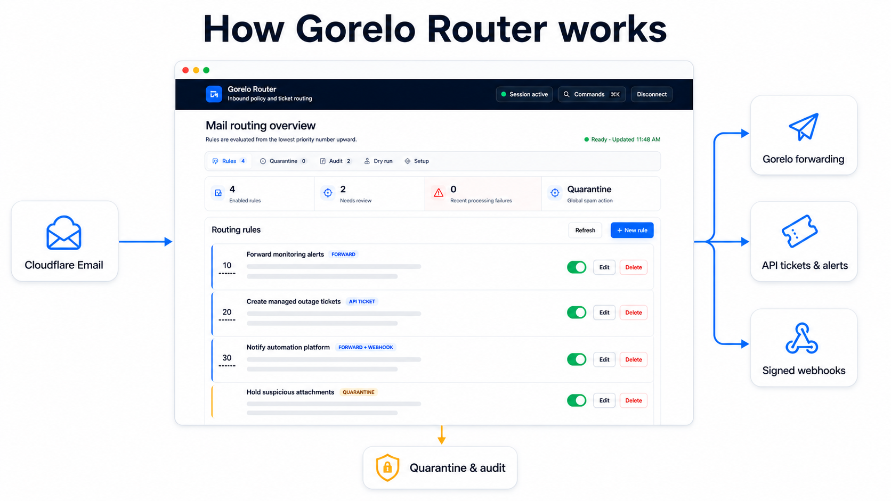

# Gorelo Router setup guide

This guide takes an operator from a local Docker trial to a production
Cloudflare Email Worker deployment. It covers the forwarding-first workflow,
optional quarantine and release, signed webhooks, and structured Gorelo ticket
or alert creation.

Gorelo Router is not an SMTP server. Cloudflare Email Routing receives the
message and invokes the Worker. The normal path forwards the original message
to a Gorelo ticketing address, preserving its MIME structure, attachments,
sender, recipients, and threading. Structured `create_ticket` and
`create_alert` rules instead send selected fields to the Gorelo API and do not
forward the original message.



This overview is based on the running Gorelo Router dashboard with synthetic
demo rules and messages. You can also view the
[unedited live dashboard capture](assets/gorelo-router-live.png). Neither image
contains credentials or customer data.

All addresses, hostnames, IDs, and tokens below are placeholders. Replace them
only in your own deployment. Never put a real credential in a rule, Wrangler
variable, D1 record, screenshot, issue, or documentation.

> **Version-sensitive vendor steps:** This guide follows the repository's
> current implementation and README. Cloudflare and Gorelo can change dashboard
> labels, limits, API scopes, and product prerequisites. Before production, use
> the linked vendor documentation to confirm the current UI path and account
> requirements.

## 1. Choose the delivery model

Start with ordinary forwarding unless you specifically need structured API
fields.

| Need                                          | Recommended action                           | Important consequence                                                   |
| --------------------------------------------- | -------------------------------------------- | ----------------------------------------------------------------------- |
| Preserve the complete email and attachments   | `forward`                                    | Gorelo's inbound address performs email-to-ticket conversion.           |
| Preserve the email and also notify automation | `forward_webhook`                            | The email is forwarded first; a signed webhook follows.                 |
| Hold a message inside Gorelo Router           | `quarantine` with `QUARANTINE_MODE=internal` | The original is held in private R2 and can be reviewed in `/admin`.     |
| Send a message to an external review mailbox  | `quarantine` with `QUARANTINE_MODE=mailbox`  | This is an immediate forward, not an in-app hold.                       |
| Control Gorelo ticket or alert fields         | `create_ticket` or `create_alert`            | The original email is not forwarded; private R2 retention is mandatory. |
| Silently discard or reject at SMTP            | `drop` or `reject`                           | Use only for high-confidence policy decisions.                          |

If no enabled rule matches, the Worker forwards to the mailbox currently marked
as the default, subject to the global spam policy. Rules are evaluated from the
lowest priority number upward, and the first match wins.

## 2. Prerequisites

Production deployment requires:

- Git, Docker Engine, and Docker Compose v2. Node.js and Wrangler are already in
  the supplied images and are never required on the host.
- The optional command-line Docker fixture also uses curl.
- A POSIX-compatible shell for the copy/paste command examples. On Windows, use
  WSL or Git Bash, or translate the commands to PowerShell.
- A Cloudflare account with the receiving domain on Cloudflare DNS.
- A Gorelo ticketing forwarding address, created in Gorelo under
  **Settings → Email → Settings**. Gorelo's
  [custom-domain and forwarding guide](https://help.gorelo.io/custom-domain)
  explains the forwarding side.
- A Cloudflare D1 database.
- A private R2 bucket when using internal quarantine, raw-message auditing, or
  API-only Gorelo actions. The checked-in production scaffold selects internal
  quarantine, so its default deployment needs this bucket.
- A scoped Gorelo API key only for client import, catalog selectors, or
  `create_ticket`/`create_alert` actions.
- A Cloudflare Email Sending sender only for automated release from internal
  quarantine.
- A webhook receiver only when using `forward_webhook`.

Both the local trial and production deployment are Docker-only. The local
container simulates the Cloudflare runtime; a separate one-shot Compose service
deploys the actual Email Worker to Cloudflare.

If Microsoft 365, Google Workspace, or another service already receives mail
for the main domain, use a dedicated ingestion subdomain such as
`alerts.example.com`. Cloudflare Email Routing cannot coexist with another mail
service on the same hostname. Confirm the current requirements in Cloudflare's
[domain documentation](https://developers.cloudflare.com/email-service/configuration/domains/)
and
[subdomain documentation](https://developers.cloudflare.com/email-service/configuration/subdomains/).

## 3. Docker quick start

Docker runs Wrangler's local Cloudflare runtime. It is useful for configuration,
rules, dry runs, audit, and simulated email events, but it does not receive SMTP
mail and is not a production replacement.

Do not publish port `8787` through Cloudflare Tunnel as the production Router.
That endpoint uses local emulated D1/R2 state and cannot receive Cloudflare Email
Routing events. The production `/admin` is served by the deployed Worker's
Custom Domain and uses its production bindings.

```bash
git clone https://github.com/jcpit/gorelo-router.git
cd gorelo-router
cp .dev.vars.example .dev.vars
chmod 640 .dev.vars
```

Edit the newly created local secret file and replace its synthetic admin-token
placeholder with a random value of at least 32 characters. Keep the file local
and uncommitted. Do not reuse a production token. The Router deliberately
rejects the tracked placeholder. Only then start Compose:

On native Linux, Compose gives the unprivileged UID/GID `1000` process
supplemental group `0` access, so root-owned mode-`0640` files work without
changing ownership. If the file belongs to a different non-root group, grant
GID `1000` read-only access with a narrow ACL or change its group to `1000`;
keep the file owner as the only writer. Docker Desktop handles bind permissions
through its file-sharing layer.

```bash
docker compose up --build
```

Open <http://localhost:8787/admin>, paste the local admin token, and select
**Connect securely**. The token remains in page memory and is not written to
browser storage.

Compose applies every pending local D1 migration in order. Local D1, R2, and
simulated Email Sending state persists in the named Docker volume across image
rebuilds and ordinary `docker compose down` operations.

If port 8787 is in use:

```bash
MAIL_PARSER_PORT=8790 docker compose up --build
```

If you use that port for the fixture below, first run
`export GORELO_ROUTER_URL=http://localhost:8790` in the same shell.

To verify the container build and complete test suite:

```bash
docker build --target test --tag gorelo-router:test .
```

To exercise the included local email fixture, first create the example rule in
the dashboard: open **Rules → + New rule → Advanced JSON**, copy the contents of
`examples/local-body-rule.json`, and save it. Then use a second terminal:

```bash
GORELO_ROUTER_URL="${GORELO_ROUTER_URL:-http://localhost:8787}"
curl --fail-with-body --request POST \
  "${GORELO_ROUTER_URL}/cdn-cgi/handler/email?from=alerts%40vendor.example&to=support%40alerts.example.net&format=json" \
  --data-binary @test/fixtures/multipart.eml
unset GORELO_ROUTER_URL
```

The result reports a simulated forward; it does not send mail to the placeholder
destination. The Docker-only `RELEASE_EMAIL` binding is also simulated.

That safety applies only to Cloudflare email forwarding/sending. Do not put
production Gorelo or webhook credentials in the local secret file. **Test
connection**, client import, and catalog selectors make real authenticated
Gorelo reads and copy returned metadata into local D1. A matching ticket/alert
rule can create a real record. A matching webhook rule performs a real HTTPS
POST to its allow-listed receiver, and invoking the five-minute scheduled
handler can retry due webhooks or process pending external actions. Saving or
opening a rule, registering a webhook destination, **Dry run**, **Teach from
sample**, and the automated tests do not deliver externally.

Stop without deleting local data:

```bash
docker compose down
```

`docker compose down --volumes` deliberately deletes the local rules, audit
history, held messages, simulated releases, and the containerized Cloudflare
login state described below. Do not use it during a normal upgrade.

## 4. Prepare Gorelo

### 4.1 Create a forwarding address

In Gorelo, create at least one ticketing forwarding address. Use separate Gorelo
addresses when different sources need different Gorelo-side group, client, tag,
or user metadata. Record the addresses in your password manager or deployment
runbook; addresses are configuration, not API secrets.

Choose the address that should become the first default and put it in
`DEFAULT_GORELO_ADDRESS`. On first initialization, Gorelo Router creates a
persistent named mailbox for that address and marks it as the registry default.
After that bootstrap, use **Setup → Gorelo mailboxes** to add names and choose
the default. A later `DEFAULT_GORELO_ADDRESS` change never silently rewrites an
existing mailbox or changes the persisted default.

List every Gorelo and review address that may receive a forward in
`ALLOWED_FORWARD_DESTINATIONS`, including the bootstrap default. Each address
must also be independently verified as a Cloudflare Email Routing destination.
The registry does not bypass either control.

### 4.2 Create an API key only if needed

Client import, Gorelo catalog selectors, and API-only actions require a scoped
Gorelo key. Give it read access only to the catalogs you use and the appropriate
ticket or alert write access only when those actions are enabled. The optional
**Test connection** diagnostic is intentionally broad: it reads clients, agent
assets, users, groups, ticket statuses, ticket tags, and ticket types. A narrowly
scoped key can skip that diagnostic and verify only its intended import,
catalog, Dry-run, and controlled live workflows. Confirm the current scope names
and regional endpoint in Gorelo's
[API overview](https://help.gorelo.io/api-overview).

The diagnostic performs seven paced, sequential, read-only probes. Paged
catalogs use one-item requests, so the test does not hydrate complete paged
catalogs, consume the Worker's external-subrequest allowance unnecessarily, or
create a ticket or alert. Each probe has a short diagnostic-only timeout so all
seven fit inside the dashboard's extended request deadline. If Gorelo returns
HTTP 429, the diagnostic may retry that GET once after a bounded `Retry-After`
delay, or a short fallback when the header is absent. The single retry budget is
shared across the entire test; ticket and alert creation requests are never
replayed. A failure reports only an allow-listed catalog stage,
request/response phase, fixed reason when one can be classified, and upstream
status when available. It never returns the key, response body, raw
`Retry-After` value, redirect destination, or provider exception text.

The Worker accepts only these exact regional origins:

- `https://api.aue.gorelo.io`
- `https://api.usw.gorelo.io`

Do not add a path, query, fragment, credentials, or custom origin.

## 5. Create Cloudflare storage

Run every production command through Compose from the repository root. If you
skipped the local trial, clone the repository first:

```bash
git clone https://github.com/jcpit/gorelo-router.git
cd gorelo-router
cp wrangler.jsonc wrangler.production.jsonc
chmod 640 wrangler.production.jsonc
```

The new production file is ignored by Git and Docker build contexts. It contains
non-secret but private account IDs, hostnames, and routing addresses. Never
force-add or publish it. Compose mounts it read-only into only the Cloudflare
tooling and deployment containers.

On native Linux, Compose gives the unprivileged UID/GID `1000` tooling process
supplemental group `0` access, so a root-owned mode-`0640` file works without
changing ownership. If the file belongs to a different non-root group, grant
GID `1000` read-only access with a narrow ACL or change its group to `1000`;
keep owner-only write access.

Build the tooling image, use Wrangler's container-friendly device login, and
confirm the exact target account before creating resources:

```bash
docker compose build cloudflare
docker compose run --rm cloudflare login --device
docker compose run --rm cloudflare whoami
```

Copy the exact account ID shown by `whoami` into the top-level `account_id` in
`wrangler.production.jsonc`, replacing its all-zero value. This pins every later
resource, secret, and deploy command to that account; do this before creating D1
or R2. The tooling wrapper refuses account-scoped commands locally until this
value is a valid, non-placeholder ID.

The OAuth credentials are stored as plaintext inside the
`gorelo-router-cloudflare-auth` Docker volume because the slim container has no
desktop keyring. Limit Docker-daemon and volume access to trusted
administrators. Ordinary `docker compose down` preserves this volume. Run
`docker compose run --rm cloudflare logout` when the local session is no longer
needed; if the volume or token is copied or compromised, also revoke the OAuth
grant in Cloudflare rather than relying only on local deletion.

Create the D1 database and private R2 bucket:

```bash
docker compose run --rm cloudflare d1 create mail-parser --no-update-config
docker compose run --rm cloudflare r2 bucket create mail-parser-quarantine --no-update-config
```

`--no-update-config` prevents Wrangler from trying to rewrite the deliberately
read-only production configuration. Copy the D1 identifier returned by Wrangler
into the `database_id` field in `wrangler.production.jsonc`, replacing only the
all-zero scaffold value. Keep the binding name `DB`; the application depends on
that name. Keep the R2 bucket private and retain the `MESSAGE_ARCHIVE` binding
name; raw email does not need a public or custom bucket domain.

Add prefix-scoped R2 lifecycle rules as secondary safety nets. Keep raw
`messages/` slightly longer than `EVENT_RETENTION_DAYS`; expire orphaned
`parser-samples/` after one day. For the scaffold's 30-day retention:

```bash
docker compose run --rm cloudflare r2 bucket lifecycle add \
  mail-parser-quarantine audit-retention messages/ --expire-days 31

docker compose run --rm cloudflare r2 bucket lifecycle add \
  mail-parser-quarantine parser-sample-backstop parser-samples/ --expire-days 1
```

The Worker's daily audit cleanup and five-minute parser-sample sweep remain the
primary deletion paths. Cloudflare lifecycle deletion may lag.

## 6. Configure the Worker

Edit only non-secret deployment settings in `wrangler.production.jsonc`. Never
put `ADMIN_API_TOKEN`, `GORELO_API_KEY`, or `WEBHOOK_SIGNING_SECRET` there.

Replace the top-level catch-all scaffold with the exact receiving hostname that
will be onboarded to Cloudflare Email Routing:

```jsonc
"addresses": ["*@alerts.example.com"],
```

Use an unused apex domain only when Cloudflare should own its mail delivery. If
another provider owns the apex MX records, use a dedicated ingestion subdomain.
The production preflight requires exactly one non-placeholder `*@domain` entry;
recipient-specific decisions belong in Gorelo Router rules.

At minimum, replace the placeholder forwarding address and choose the intended
quarantine posture:

```jsonc
"vars": {
  "DEFAULT_GORELO_ADDRESS": "tickets@your-gorelo-route.example",
  "ALLOWED_FORWARD_DESTINATIONS": "tickets@your-gorelo-route.example,review@example.com",
  "QUARANTINE_MODE": "internal",
  "ARCHIVE_MODE": "quarantine",
  "SPAM_THRESHOLD": "5",
  "SPAM_ACTION": "forward",
  "EVENT_RETENTION_DAYS": "30",
  "GORELO_API_BASE_URL": "https://api.aue.gorelo.io"
}
```

`DEFAULT_GORELO_ADDRESS` bootstraps the initial named registry mailbox only.
Once that mailbox registry exists, changing this variable does not resynchronize
the stored address or current default; make those changes deliberately in
Setup. The copied scaffold explicitly selects `internal` quarantine. If
`QUARANTINE_MODE` is omitted entirely, the runtime fallback is `mailbox`.
Configure the value deliberately rather than relying on that fallback.

### Production admin hostname

Before the first production deploy, choose a dedicated admin hostname on an
active Cloudflare zone, such as `gorelo-router.example.com`. Protect the entire
hostname—not only `/admin`—with a Cloudflare Access allow policy for your
operators. In **Zero Trust → Access controls → Applications**, create a
**Self-hosted and private** application, add the public hostname, and configure
your identity provider, MFA, session lifetime, and least-privilege allow policy.

Then replace the hostname at the top level of `wrangler.production.jsonc`:

```jsonc
"workers_dev": false,
"preview_urls": false,
"routes": [
  {
    "pattern": "gorelo-router.example.com",
    "custom_domain": true
  }
],
```

A Custom Domain makes the Worker the origin and lets Cloudflare provision its
DNS record and certificate. The hostname must be in a zone you control and must
not already have a conflicting CNAME. Keeping both `workers_dev` and preview
URLs disabled prevents an alternate HTTP hostname from bypassing Access. Email
Routing still invokes the Worker's email handler independently of these HTTP
routes. See Cloudflare's current
[Custom Domain](https://developers.cloudflare.com/workers/configuration/routing/custom-domains/),
[workers.dev](https://developers.cloudflare.com/workers/configuration/routing/workers-dev/),
and
[Access application](https://developers.cloudflare.com/cloudflare-one/access-controls/applications/http-apps/self-hosted-public-app/)
instructions.

### Configuration reference

| Setting                        | Purpose and valid posture                                                                                                                                                                                                      |
| ------------------------------ | ------------------------------------------------------------------------------------------------------------------------------------------------------------------------------------------------------------------------------ |
| `DEFAULT_GORELO_ADDRESS`       | Required bootstrap address used to create the first persistent named mailbox and initial default. It is not silently resynchronized after the registry exists.                                                                 |
| `ALLOWED_FORWARD_DESTINATIONS` | Comma-separated destinations that named mailboxes, legacy rules, quarantine, failure routing, or release may use. Every address must also be independently verified by Cloudflare.                                             |
| `QUARANTINE_MODE`              | `internal` for an R2-backed hold, or `mailbox` for immediate forwarding to a review mailbox.                                                                                                                                   |
| `ARCHIVE_MODE`                 | `none`, `quarantine`, or `all`. Internal holds and API-only Gorelo actions are always retained regardless of this value.                                                                                                       |
| `QUARANTINE_ADDRESS`           | Review mailbox for mailbox mode. It is required when mailbox mode uses `SPAM_ACTION=quarantine`, unless only explicit rule destinations are used while the global spam action is different.                                    |
| `FAILURE_FORWARD_ADDRESS`      | Optional review destination for parser, D1, forwarding, or definitive API-action failures. If absent, the quarantine address is used; if neither exists, the Worker rejects failures instead of using the normal Gorelo route. |
| `RELEASE_FROM_ADDRESS`         | Optional service sender for internal-hold release. It must be configured together with `RELEASE_EMAIL`.                                                                                                                        |
| `SPAM_THRESHOLD`               | Integer from 0 through 8; scaffold value 5.                                                                                                                                                                                    |
| `SPAM_ACTION`                  | Start with `forward` for observation. Other values are `quarantine`, `drop`, and `reject`.                                                                                                                                     |
| `SPAM_KEYWORDS`                | Optional comma-separated subject phrases replacing the built-in defaults.                                                                                                                                                      |
| `TRUSTED_SENDER_DOMAINS`       | Optional envelope-sender domains that subtract two score points. This is a hint, not authentication.                                                                                                                           |
| `MAX_PARSE_BYTES`              | Largest raw message eligible for body or attachment parsing; scaffold value 10 MiB.                                                                                                                                            |
| `MAX_BODY_CHARACTERS`          | Searchable body prefix retained in memory; scaffold value 200,000 characters.                                                                                                                                                  |
| `MAX_HTML_SCAN_CHARACTERS`     | HTML prefix scanned to derive searchable text; scaffold value 500,000 characters.                                                                                                                                              |
| `EVENT_RETENTION_DAYS`         | D1 metadata retention from 1 through 365 days; scaffold value 30.                                                                                                                                                              |
| `GORELO_API_BASE_URL`          | Exact Australia or US origin listed above.                                                                                                                                                                                     |
| `GORELO_CATALOG_CACHE_SECONDS` | Selector-cache lifetime from 60 through 3,600 seconds; scaffold value 300.                                                                                                                                                     |
| `ALLOWED_WEBHOOK_HOSTS`        | Optional comma-separated exact public DNS hostnames. No schemes, wildcards, IP literals, ports, or local names.                                                                                                                |
| `WEBHOOK_TIMEOUT_MS`           | Webhook timeout from 50 through 30,000 milliseconds; scaffold value 8,000.                                                                                                                                                     |

Keep `SPAM_ACTION=forward` until you have observed representative scores in
Audit. The score is a bounded subject/envelope heuristic, not antivirus,
phishing detection, reputation, URL analysis, or sender authentication.

If content rules are enabled, place a metadata-only size rule before them so
oversized messages receive a deterministic action instead of reaching MIME
parsing. With the scaffold's 10 MiB parsing limit, the example threshold is
10,485,761 bytes. Update it whenever `MAX_PARSE_BYTES` changes.

## 7. Configure secrets and the admin token

The first deployment automatically generates `ADMIN_API_TOKEN` with
`openssl rand -base64 48` and deploys it with the real Worker code without
reconciling the declared HTTP, schedule, or email triggers. It displays the
active 384-bit value once before trigger reconciliation. Existing triggers stay
in place during this first phase on an upgrade. Run the first deployment from
an interactive terminal and save the value in a password manager before
answering any later routing prompt. The container asks for explicit
confirmation before generating it. Cloudflare stores the secret but cannot
reveal it later.

The token is never placed on a command line, in an environment variable, host
file, Git, `vars`, or D1. It exists briefly in a mode-`0600` file on the deploy
container's memory-backed `/tmp`, which is removed on exit. Every `/api/v1`
endpoint requires this bearer token. `/healthz` is Router-unauthenticated and
reports liveness/configuration only; keep it behind the production Cloudflare
Access policy.

After the first deployment succeeds, optional features use separate interactive
secret commands:

```bash
docker compose run --rm cloudflare secret put GORELO_API_KEY
docker compose run --rm cloudflare secret put WEBHOOK_SIGNING_SECRET
```

Only set `GORELO_API_KEY` if Gorelo integration features are needed. Generate
`WEBHOOK_SIGNING_SECRET` as a high-entropy value of at least 32 bytes. The
dashboard never asks for or returns either secret.

The admin token is a shared bearer credential, not an individual operator
identity. Cloudflare Access should provide the user boundary. The dashboard
keeps the token only in page memory, so an operator may need to enter it again
after a reload or new session.

Ordinary deployments inspect secret names and preserve an existing admin token;
they never display or rotate it. If the one-time value is lost or rotation is
required, generate and deploy a replacement intentionally:

```bash
docker compose run --rm --build deploy --rotate-admin-token
```

Save the new one-time value, verify it, and remove the old value from your
password manager and operational systems. Rotate an optional secret by repeating
its Compose `secret put` command. If any credential is ever committed or
publicly exposed, revoke or rotate it immediately; deleting it from Git does not
make it safe again.

## 8. Verify Cloudflare forwarding destinations

In Cloudflare, open **Compute → Email Service → Email Routing → Destination
Addresses**. Add and complete verification for every Gorelo named mailbox,
legacy rule destination, and review address the Worker may pass to
`message.forward()`.

There are two independent controls:

1. Gorelo Router checks the address against
   `ALLOWED_FORWARD_DESTINATIONS`, whether it came from a named mailbox, a
   legacy rule, or the configured quarantine/failure route.
2. Cloudflare permits forwarding only to its verified destination addresses.

Both must allow an address. A destination override that passes one control but
not the other will fail.

See Cloudflare's
[destination-address documentation](https://developers.cloudflare.com/email-service/configuration/email-routing-addresses/).

## 9. Onboard the receiving domain

Activate Email Routing and confirm its DNS state before deploying the declared
catch-all:

1. Open **Compute → Email Service → Email Routing**.
2. For an unused apex domain, select **Onboard Domain**, review the MX, SPF, and
   DKIM changes, and select **Done**. Do not replace an existing mail provider's
   apex MX records unless that cutover is intentional.
3. For the recommended ingestion subdomain, onboard/select the apex zone, open
   **Settings → Subdomains**, add the exact subdomain such as `alerts`, and let
   Cloudflare add its routing DNS records.
4. Wait for DNS propagation and confirm Email Routing shows the selected
   hostname and its required records as active. Do not continue while MX or
   verification status is incomplete.
5. Confirm the top-level `addresses` value in `wrangler.production.jsonc` is
   the same hostname, expressed as `*@domain`.
6. Review every explicit rule on that hostname. Explicit matches take
   precedence over the catch-all. Remove or repoint any address that should be
   evaluated and audited by Gorelo Router; retain a bypass only deliberately.
   Rules that point to a different Worker are not silently removed by Gorelo
   Router's deployment.

## 10. Deploy and bind the catch-all

Confirm the exact Cloudflare account again, then run the one-shot production
deployment container:

```bash
docker compose run --rm cloudflare whoami
docker compose run --rm --build deploy
```

The container scans the deployable source tree; refuses an all-zero Cloudflare
account or D1 ID, scaffold Gorelo address, HTTP hostname, or inbound catch-all;
runs formatting, type, test, and Worker build checks; then inspects only the
names of the target Worker's configured secrets. Inspection failures stop
before D1 changes. A new Worker or confirmed missing admin secret causes the
container to generate `openssl rand -base64 48`; an existing secret is
preserved. Only after those checks pass does it apply every pending additive D1
migration in order. The same Docker command initializes a new database or
upgrades an existing one, and D1 records which migrations have already been
applied. It then derives an ephemeral core config that leaves HTTP, schedule,
and email trigger reconciliation for the second phase; deploys the matching
code and any new token as one active Worker version; verifies Wrangler recorded
a real version ID; then reconciles every trigger from the full production
config. Existing triggers remain attached while an upgrade's core version is
activated. The mode-`0600` token file lives only on the ephemeral container's
memory-backed `/tmp` and is deleted immediately after confirmed core
activation. This avoids the temporary public dummy Worker that first-run
`secret put` can otherwise create. Schema changes are additive; there is no
automatic downgrade. Optional integration readiness is checked after
authentication in Setup.

The generated token is displayed after confirmed core activation but before
trigger reconciliation. Save it immediately. If activation cannot be confirmed,
the script displays the possibly active value for incident handling and directs
you to rerun with `--rotate-admin-token` to establish a new known value. If
trigger reconciliation fails, keep the active token and rerun the ordinary
deployment without rotation.

Wrangler also reconciles the top-level `addresses` declaration during this
deployment. The `*@domain` entry becomes an enabled catch-all with an `all`
matcher and `worker:gorelo-router` action. If the domain already has a catch-all
managed through the dashboard or API, Wrangler displays a takeover conflict and
asks whether to apply it. Check the exact domain and old/new actions before
answering yes. Also review any deletion of an old address previously owned by
this Worker; `addresses` is declarative source-of-truth configuration. Declining
leaves the existing routing action in place even though the new Worker version
is already active; correct the configuration and rerun.

Confirm the result against the apex Cloudflare DNS zone. Wrangler's list command
resolves a zone by its exact name, so use `example.com` here even when the
configured inbound address is `*@alerts.example.com`:

```bash
docker compose run --rm cloudflare email routing rules list example.com
```

The final line must report an enabled catch-all whose action is
`worker:gorelo-router`. Then send a non-sensitive message to a previously
undefined recipient and confirm it appears in Audit.

Do not use `wrangler email routing rules update ... catch-all --action-type
worker` with Wrangler 4.120.0. That open-beta subcommand incorrectly rejects a
Worker action before it calls Cloudflare. The normal `deploy` path above uses
Cloudflare's supported catch-all API and is the Docker-native configuration for
this project. The dashboard's **Catch-all → Send to a Worker** control remains a
manual recovery option, but a later deployment will reconcile it to the
top-level `addresses` declaration.

Cloudflare's current
[routing rule guide](https://developers.cloudflare.com/email-service/configuration/email-routing-addresses/),
[catch-all API](https://developers.cloudflare.com/api/resources/email_routing/subresources/rules/subresources/catch_alls/),
[Wrangler address-reconciliation release notes](https://github.com/cloudflare/workers-sdk/releases/tag/wrangler%404.113.0),
[domain configuration](https://developers.cloudflare.com/email-service/configuration/domains/),
and
[subdomain setup](https://developers.cloudflare.com/email-service/configuration/subdomains/)
document the Worker action, API shape, dashboard flow, and DNS requirements.

Create recipient-specific policies inside Gorelo Router. A message that matches
no application rule follows the configured global spam action and, on the
normal forward path, the mailbox currently marked as default. A
catch-all increases the exposed recipient surface, so use a dedicated ingestion
subdomain when the main domain has unrelated mail, keep spam/quarantine and
failure routing configured, and independently authenticate trusted upstreams;
email headers, envelope sender domains, and extracted customer names can be
forged.

## 11. Protect and open the admin console

Confirm the Access application covers the whole hostname, the Custom Domain is
active, and **Workers & Pages → gorelo-router → Settings → Domains & Routes**
shows no enabled `workers.dev`, preview, alternate hostname, or other direct
route around Access. Then visit:

```text
https://gorelo-router.example/admin
```

Enter `ADMIN_API_TOKEN` and select **Connect securely**. In **Setup**:

1. Select **Refresh setup**.
2. Resolve every `missing` readiness item.
3. If the Gorelo key includes every broad diagnostic read scope listed in
   section 4.2, select **Test connection**. With a narrower key, verify only the
   imports, selectors, and actions it is intended to support.
4. Re-run readiness after enabling rules or changing bindings, mailboxes,
   imports, or webhook destinations.

### Configure named Gorelo mailboxes

The first Setup load initializes one persistent mailbox named **Default Gorelo
mailbox** from `DEFAULT_GORELO_ADDRESS`. This is a one-time bootstrap, not a
continuous environment-variable sync.

1. Open **Setup → Gorelo mailboxes**.
2. Rename it to an operator-friendly label such as `Service Desk`.
3. Add each additional Gorelo forwarding address with a unique name. The
   address must already be present in `ALLOWED_FORWARD_DESTINATIONS` and
   verified in Cloudflare; otherwise it is unavailable for routing.
4. Mark exactly one enabled, allow-listed mailbox as the default. The previous
   default remains registered but is no longer used for unmatched mail.
5. Select a named mailbox for every new guided rule. The rule stores that
   mailbox's stable ID, even when the selected mailbox is currently the
   default.

Changing the default affects unmatched mail and legacy default routes that have
neither a `mailboxId` nor a literal `destination`. It does not repoint rules
pinned to a mailbox ID. Renaming a mailbox also leaves pinned rules intact.
Existing Advanced JSON rules that use a literal `destination` remain supported,
but new guided rules use named mailboxes. A mailbox referenced by rules cannot
be silently removed or made unroutable; resolve those rule references first.

Readiness validates the migrated D1 schema and only requires optional
integrations used by enabled rules. It also checks the selected quarantine and
archive posture. Automated release is reported as optional when neither release
setting is present, but a half-configured release is reported as missing.

Cloudflare Access identity is recorded for review actions only when both its
authenticated-user and assertion headers are present. The Worker does not
cryptographically validate the assertion itself, so actor names are trustworthy
only when Access is enforced on the sole reachable HTTP route.

## 12. Create the first rule

No rule is required for basic delivery: unmatched mail already takes the default
Gorelo route. A first explicit rule is useful for attribution and demonstrates
ordering without changing the destination.

1. Open **Rules** and select **+ New rule**.
2. Name it `Route vendor parser recipient`.
3. Set priority `100`. Lower numbers run first.
4. Choose **Match all conditions** and keep **Rule enabled** selected.
5. Add a `to_local_part` condition with `equals` and the placeholder value
   `alerts+vendor`.
6. Choose **Forward to Gorelo**.
7. Select the intended named **Gorelo mailbox**. Selecting the mailbox currently
   marked default still pins this rule to its stable ID.
8. Leave spam bypass off.
9. Save, then use **Dry run** with the same recipient local part and confirm the
   rule name, forward action, destination, spam score, and decision reason.

The equivalent Advanced JSON is:

```json
{
  "name": "Route vendor parser recipient",
  "description": "Explicitly attribute mail for one dedicated parser recipient",
  "priority": 100,
  "enabled": true,
  "match": "all",
  "conditions": [
    {
      "field": "to_local_part",
      "operator": "equals",
      "value": "alerts+vendor"
    }
  ],
  "action": {
    "type": "forward",
    "mailboxId": "replace-with-selected-mailbox-id"
  }
}
```

Rules take effect on the next inbound message. The guided editor can follow the
current default by omitting both destination fields or pin a stable mailbox ID.
A legacy literal `destination` remains supported only when the address is both
allow-listed and Cloudflare-verified. See
[rules.md](rules.md) for every field, operator, action, and example.

## 13. Teach fields from a sample

The sample trainer is available for `forward_webhook`, `create_ticket`, and
`create_alert` actions.

The preferred path begins with a real retained message:

1. Open **Audit**, expand a representative email, and select **Create rule from
   this email**.
2. Choose Forward email, Forward + webhook, Create Gorelo ticket, or Create
   Gorelo alert. Forwarding choices also ask whether to follow the default or
   pin a named Gorelo mailbox. Plain forwarding creates a routing draft without
   extraction; choose one of the other three outcomes to teach variables.
3. Review the conservatively prefilled conditions. The generated rule is a
   disabled draft; it cannot affect live mail until it is deliberately saved
   and enabled.
4. In the trainer, highlight a changing value in From, To, Subject, or the
   normalized plain-text body.
5. Assign a safe key such as `customer`, `device`, `summary`, or `details`.
6. Confirm the inferred literal markers extract exactly the highlighted value.
7. Repeat for other values, then apply the variables.
8. Insert the resulting `{{field_key}}` placeholders into a Gorelo template, or
   map the variables into the webhook action.
9. Dry-run several representative messages before saving or enabling the rule.

You can still start in Rules and use **Teach from sample** with pasted content
or the current Dry-run sample.

The trainer uses bounded literal text around the selection. It does not execute
regular expressions or templates, retain a semantic model, adapt automatically,
or learn several layouts. If a vendor has two simultaneous layouts, use two
narrowly conditioned rules in explicit priority order.

An Audit sample exposes only normalized plain text to the trainer. HTML,
attachments, raw RFC 5322 content, archive keys, and active embedded content are
never exposed through this workflow. The sample is not saved with the rule;
only inferred markers and variable names are applied. Inference does not call
Gorelo or a webhook. The inferred markers can contain adjacent static text, so
do not train on credentials or unnecessary personal data. When retraining,
reuse existing variable names where downstream mappings depend on them and
dry-run both current and transition layouts.

### Capture the next matching message

An older Audit item may have sender, recipient, and subject metadata but no
usable body. Select **Capture next** only when a new representative message can
be sent safely.

1. Confirm the exact inbound recipient. Optionally narrow the request with the
   offered exact sender address or sender domain and a literal subject filter.
2. Start the capture. The opt-in wait lasts 15 minutes and captures only the
   first inbound message satisfying those criteria.
3. Send or wait for the representative message. Gorelo Router continues its
   normal policy evaluation, forwarding, ticket/alert action, webhook, and
   Audit recording; teaching does not hold, reroute, or duplicate the email.
4. When the sample is ready, return to the trainer, select the values, and
   create the disabled rule draft.

Capture matching is deliberately narrow and never becomes a catch-all content
recorder. A pending request can be cancelled and expires without a match after
15 minutes. For a match, the Router extracts a bounded normalized plain-text
sample into private R2 and makes it available for at most 60 minutes. The
temporary teaching object contains no HTML, attachments, or raw MIME and is
separate from any raw-message archive required by quarantine or API-only
actions. After expiry it cannot be used for training.

## 14. Import Gorelo clients and configure aliases

This section is required before enabling `create_ticket` or `create_alert`, and
whenever a `forward_webhook` rule resolves an extracted field as a Gorelo client.

1. Confirm the exact `GORELO_API_BASE_URL` region and set
   `GORELO_API_KEY` as a Worker secret.
2. Deploy the settings and open **Setup**. **Test connection** is an optional
   broad catalog diagnostic; use it only when the key has the scopes listed in
   section 4.2.
3. Select **Import from Gorelo** under **Client directory**.
4. Search for a client by name, domain, alias, or ID.
5. Select the Gorelo client and add every exact external customer name, one per
   line. A batch may contain up to 100 aliases and is all-or-none.
6. Use scope `global` for aliases shared by every source. Use a stable source
   scope such as `vendor-a` when the same text should mean something different
   for a specific parser.
7. Paste a real source value into **Preview exact resolution**, use the same
   scope as the rule, and select **Preview match**.
8. Enable dynamic client resolution only after every expected value resolves to
   exactly one current client.

Resolution is deterministic: source-scoped alias, global alias, then exact
current Gorelo name, billing name, alternate name, or domain. It never makes a
fuzzy guess. Missing, stale, or ambiguous identities fail closed. Alias
edits/deletes are version-safe, and a value colliding with another current
client identity is rejected.

Re-import after client-directory changes. Clients no longer returned by Gorelo
are retained locally as stale so an alias is not silently reassigned. A later
catalog change can introduce a collision, so preview critical resolutions again
after every import.

An exact alias is routing data, not authentication. Use dynamic client mapping
only on a dedicated parser recipient with an independently trusted upstream
source.

## 15. Optional features

### 15.1 Raw archive and quarantine

`ARCHIVE_MODE=none` avoids routine raw retention. `quarantine` retains
quarantine decisions, and `all` retains every decision. Internal quarantine and
API-only Gorelo actions always archive the raw message even when the setting is
`none`.

With `QUARANTINE_MODE=internal`, a quarantine decision stores the original in
private R2 and creates a versioned review item in D1. An operator can inspect
safe text, download the EML, add a note, dismiss it, or release it when Email
Sending is configured.

With `QUARANTINE_MODE=mailbox`, a quarantine decision is immediately forwarded
to `QUARANTINE_ADDRESS` or the rule's explicit review destination. The mailbox
owns disposition. Even when an R2 audit copy exists, the dashboard does not
present it as a releasable hold.

### 15.2 Automated release from internal quarantine

The production scaffold intentionally omits Email Sending. To enable release:

1. Onboard the sender domain in Cloudflare under **Compute → Email Service →
   Email Sending**.
2. Add a restricted top-level binding to `wrangler.production.jsonc`:

   ```jsonc
   "send_email": [
     {
       "name": "RELEASE_EMAIL",
       "allowed_destination_addresses": [
         "tickets@your-gorelo-route.example"
       ],
       "allowed_sender_addresses": [
         "gorelo-router@your-domain.example"
       ]
     }
   ]
   ```

3. Add this value inside `vars`:

   ```jsonc
   "RELEASE_FROM_ADDRESS": "gorelo-router@your-domain.example"
   ```

4. Put every selectable release destination in both
   `ALLOWED_FORWARD_DESTINATIONS` and the binding's
   `allowed_destination_addresses`. Keep the two intended-release sets in sync;
   passing only one allow-list is not enough.
5. Deploy, refresh Setup, and live-test sender association, threading, and
   attachments with non-sensitive mail.

Release uses a service-controlled From/To while preserving original provenance
in `X-Mail-Parser-*` headers and retaining the original MIME body and
attachments. Only pre-dispatch preparation failures become retryable
`release_failed`. If dispatch begins and the result is uncertain, the item
stays non-actionable in `releasing`; check the destination and audit before any
manual remediation. Do not blindly release it again.

The `send_email` binding restrictions are independent of Gorelo Router's
allow-list. Confirm the current requirements in Cloudflare's
[Email Sending documentation](https://developers.cloudflare.com/email-service/api/send-emails/workers-api/)
and
[binding restrictions](https://developers.cloudflare.com/email-service/configuration/send-bindings/).

### 15.3 Signed webhooks

1. Add the receiver's exact public DNS hostname to
   `ALLOWED_WEBHOOK_HOSTS`; do not include `https://`, a path, wildcard, IP,
   port, or local hostname.
2. Set `WEBHOOK_SIGNING_SECRET` through the Compose secret command and redeploy
   with the one-shot `deploy` service.
3. Open **Setup → Webhook destinations** and select **+ Destination**.
4. Enter a name and complete HTTPS URL on an allowed host, leave it enabled,
   and save. Registration does not send a test request.
5. Create a `forward_webhook` rule, choose the registered destination, set a
   stable event type, and map one to 50 fields.
6. Dry-run extraction and client resolution before sending a controlled live
   message.

Rules store a destination ID, not a URL. Requests include a timestamp, event
ID, stable delivery/idempotency ID, and
`X-Mail-Parser-Signature: v1=<hex>` over the timestamp, a period, and the exact
JSON bytes using HMAC-SHA256. The receiver must verify the signature over the
untouched body, reject stale timestamps, and deduplicate the delivery ID.

The primary email remains successful even when extraction or webhook delivery
fails. Explicit HTTP 429/5xx responses are retried by the five-minute cron, up
to five total attempts. Network errors, timeouts, abandoned claims, and
destination-version drift become `uncertain` and are not automatically resent.

### 15.4 Gorelo API-only ticket and alert actions

Before enabling either action, confirm all of the following:

- `GORELO_API_KEY` has the required least-privilege scopes.
- `GORELO_API_BASE_URL` is the correct exact region.
- `MESSAGE_ARCHIVE` is bound to a private R2 bucket.
- The current Gorelo client directory has been imported.
- Fixed client selection or dynamic alias resolution identifies exactly one
  current client.
- Required Gorelo catalogs load in the guided rule editor.
- A Dry run produces the expected bounded `goreloPreview`.

`create_ticket` requires a title, client, status, group, and ticket type.
Optional selectors include priority, source, users, tags and, for a fixed
client, locations, contacts, and agent assets. `create_alert` requires name,
client, resource, and severity 1 through 4. The editor fills supported IDs from
current/cached Gorelo catalogs.

These actions do not forward the original MIME message or attachments. They
retain it privately in R2, write a credential-free delivery snapshot, and make
at most one provider attempt. A definitive preflight or 4xx failure may use the
configured failure route. A network error, timeout, 5xx, invalid/oversized
response, or abandoned claim becomes `uncertain` because Gorelo might have
created the record. It is never automatically retried or fallback-forwarded;
check Gorelo and Audit before manual action.

## 16. End-to-end verification

Complete these checks before changing production MX traffic or enabling a
destructive rule:

1. Run the isolated Docker verification target:

   ```bash
   docker build --target test --tag gorelo-router:test .
   ```

2. After authenticating through Cloudflare Access, open
   `https://gorelo-router.example/healthz` and confirm it reports healthy. The
   endpoint does not require the Router bearer token, but the production Access
   policy should still protect it. An automated monitor needs its own scoped
   Access service-token policy; never make the whole hostname public for health
   checks.

3. In `/admin`, open **Setup**, refresh readiness, and resolve all required
   checks.
4. In **Dry run**, test matching, non-matching, spam-threshold, oversized, and
   failure-path examples. Dry run neither sends nor stores a message.
5. Send a non-sensitive live test to a specific ingestion recipient.
6. Confirm Audit shows the intended rule, reason, destination, and safe message
   facts. For email actions, `forwarded` means Cloudflare accepted the forward;
   it does not prove final mailbox delivery.
7. Confirm the ticket or message arrived in Gorelo with the expected threading
   and attachment behavior.
8. If using internal quarantine, verify hold, EML download, dismiss, and—only
   when deliberately configured—release.
9. If using webhooks, verify timestamp/signature validation and idempotency at
   the receiver, including a controlled retryable response.
10. If using an API-only action, test with a deliberately selected non-production
    client and confirm both Gorelo and the immutable delivery attempt in Audit.

The authenticated readiness endpoint is also available at
`GET /api/v1/readiness`. Prefer the dashboard for routine use so operators do
not place bearer tokens in shell history or URLs.

## 17. Operations and maintenance

- Review **Audit** for processing failures and `failed` or `uncertain` outbound
  deliveries. Investigate uncertain outcomes before any manual retry.
- Review **Quarantine** for `pending`, `release_failed`, and long-running
  `releasing` items. A `releasing` item can represent an uncertain accepted
  send and must not be blindly retried.
- Monitor Worker exceptions, D1/R2 failures, quarantine volume, and storage use.
  Observability is enabled in the checked-in Wrangler configuration.
- Keep `SPAM_ACTION=forward` until representative traffic has been observed;
  tune subject keywords and threshold conservatively.
- Re-import Gorelo clients after catalog changes and preview important aliases
  again before enabling or re-enabling structured rules.
- Refresh `/api/v1/readiness` after every schema, binding, secret, enabled
  rule, client import, or webhook-destination change.
- Rotate the admin token, Gorelo key, and webhook signing key under your normal
  credential policy. Coordinate signing-key changes with webhook receivers.
- Review `EVENT_RETENTION_DAYS` and the slightly longer R2 lifecycle against
  client agreements, privacy obligations, and storage requirements.
- The `*/5 * * * *` trigger handles webhook retries, pending Gorelo deliveries,
  and parser-capture recovery/expiry/cleanup. The `17 3 * * *` trigger handles
  audit retention, as defined in `wrangler.production.jsonc`. Confirm
  Cloudflare's current cron timezone semantics and scheduled-trigger health
  after deployment.
- Use a specialist email-security layer for malware, phishing, BEC, URL
  reputation, and attachment-content inspection. Gorelo Router checks
  attachment filenames and bounded text only.

## 18. Upgrades

Before upgrading, review the upstream changes and back up the ignored
`wrangler.production.jsonc` through your approved private configuration system.
Secrets remain in Cloudflare and should not be copied into the repository.

First confirm a tested D1/R2 recovery path appropriate to your account and
retention requirements. The repository uses ordered, additive D1 migrations
and has no automatic database downgrade. Pull the reviewed release and use the
same guarded Docker deployment path:

```bash
git status --short
git pull --ff-only
docker compose run --rm cloudflare whoami
docker compose run --rm --build deploy
```

The ignored production configuration does not participate in `git pull`. If
other tracked local changes block a fast-forward, review and merge them using
your normal Git workflow. Do not replace `wrangler.production.jsonc` with the
updated scaffold or overwrite its D1 ID, bucket binding, destination allow-list,
or regional settings.

After every pull, compare the updated tracked `wrangler.jsonc` scaffold with
your ignored production file. Merge any new required bindings, variables,
triggers, compatibility settings, or security keys while preserving the private
account/D1 IDs, Custom Domain, allowlists, and routing settings. Complete this
review before running `deploy`.

The deployment container automatically applies every pending migration before
the code that expects it. D1 records completed migrations, so rerunning the same
deployment is safe and does not reapply them. After the deploy, refresh Setup
readiness, confirm the named mailbox/default state, run a Dry run, send a
controlled live message, and inspect Audit.

After updating the source, rebuild the local Docker environment:

```bash
docker compose up --build -d
```

The entrypoint applies the local schema and reuses the existing named volume.
Do not add `--volumes` unless erasing all local Router data is intentional.

Confirm the current backup and recovery options in Cloudflare's
[D1 Time Travel documentation](https://developers.cloudflare.com/d1/reference/time-travel/)
before every production schema upgrade. A restore is itself destructive, so
record the pre-change bookmark and rehearse the recovery procedure outside an
incident.

## 19. Troubleshooting

If D1 or R2 creation reports success and then `EROFS`, the resource exists; do
not create it again. Wrangler only failed to rewrite the read-only configuration.
For D1, copy the returned ID into `database_id` while preserving binding `DB`.
Use `--no-update-config` on future resource creation commands.

| Symptom                                                     | Checks and resolution                                                                                                                                                                                                                                                                                                                                                                                                                                                           |
| ----------------------------------------------------------- | ------------------------------------------------------------------------------------------------------------------------------------------------------------------------------------------------------------------------------------------------------------------------------------------------------------------------------------------------------------------------------------------------------------------------------------------------------------------------------- |
| Cloudflare account is not configured                        | Run `docker compose run --rm cloudflare whoami`, copy the intended Account ID into `account_id` in `wrangler.production.jsonc`, then retry.                                                                                                                                                                                                                                                                                                                                     |
| Deploy preflight says configuration is incomplete           | Replace the all-zero Cloudflare `account_id`, D1 `database_id`, scaffold Gorelo address, `router.example.com` HTTP hostname, and `*@example.com` inbound catch-all in `wrangler.production.jsonc`. Keep `workers_dev` and `preview_urls` false.                                                                                                                                                                                                                                 |
| Deployment cannot inspect `ADMIN_API_TOKEN`                 | Confirm Wrangler authentication, account selection, Worker name, and Cloudflare availability. Inspection fails closed and never treats an unknown API error as a missing token.                                                                                                                                                                                                                                                                                                 |
| First deployment requires an interactive terminal           | Do not use `-T`, redirect output, or run first-time generation unattended. Run the Compose deployment interactively, confirm generation, and save the displayed token immediately.                                                                                                                                                                                                                                                                                              |
| `/admin` rejects the token                                  | Confirm the token belongs to this deployed Worker and was not copied with whitespace. Rotate it if its handling is uncertain.                                                                                                                                                                                                                                                                                                                                                   |
| `/healthz` works but readiness fails                        | `/healthz` is only Router-unauthenticated liveness/configuration and should still sit behind Access. Open authenticated Setup or `/api/v1/readiness`, then fix the named schema, binding, release, client, or webhook check.                                                                                                                                                                                                                                                    |
| D1 schema is missing or behind                              | Confirm the intended account and D1 ID, then rerun `docker compose run --rm --build deploy`; it automatically applies every pending additive migration before deploying.                                                                                                                                                                                                                                                                                                        |
| A named mailbox is unavailable                              | Confirm it is enabled, its address remains in `ALLOWED_FORWARD_DESTINATIONS`, and the same address is verified in Cloudflare. Changing `DEFAULT_GORELO_ADDRESS` does not repair or rewrite an existing registry; use Setup.                                                                                                                                                                                                                                                     |
| Mail followed the wrong default                             | Check **Setup → Gorelo mailboxes**. Changing the persistent default affects unmatched mail and legacy default routes without a mailbox ID or literal destination, but not pinned rules.                                                                                                                                                                                                                                                                                         |
| Capture next did not collect a body                         | Confirm the 15-minute request is still pending and the message exactly satisfies its recipient and optional sender/subject filters. Normal routing continues even when capture does not match. Start a new narrow request after expiry.                                                                                                                                                                                                                                         |
| Mail never reaches the Worker                               | Confirm `addresses` names the onboarded hostname, MX is active, and `rules list` reports an enabled `worker:gorelo-router` catch-all. Rerun the interactive deployment and approve the verified takeover; Wrangler 4.120's catch-all `rules update` is broken. Explicit recipient rules bypass the Router, so remove or repoint unintended exceptions. Check an unfiltered Worker tail.                                                                                         |
| A forward destination is rejected                           | The address must be valid, application allow-listed, and verified as a Cloudflare Email Routing destination. Check both controls.                                                                                                                                                                                                                                                                                                                                               |
| Message processing fails instead of using the default route | This is intentional fail-closed behavior. Inspect Audit and the configured `FAILURE_FORWARD_ADDRESS`/`QUARANTINE_ADDRESS`; failures never silently fall through to normal Gorelo delivery.                                                                                                                                                                                                                                                                                      |
| Body or attachment rule fails for a large message           | Compare raw size with `MAX_PARSE_BYTES`. Add a higher-priority metadata-only size rule and consider representative Workers Paid limits for production content parsing.                                                                                                                                                                                                                                                                                                          |
| Quarantine shows no releasable items                        | Mailbox mode is not an in-app hold. Use internal mode for holds, and configure both `RELEASE_EMAIL` and `RELEASE_FROM_ADDRESS` for automated release.                                                                                                                                                                                                                                                                                                                           |
| Release is stuck in `releasing`                             | Treat it as uncertain. Check the Gorelo destination and recorded message ID before any manual remediation; do not resubmit automatically.                                                                                                                                                                                                                                                                                                                                       |
| Gorelo **Test connection** fails                            | Use its safe `stage`, `phase`, `reason`, and optional `upstreamStatus` details to identify the failed catalog or blocked redirect. HTTP 429 is paced and retried once when Gorelo permits a short wait; if it persists, wait before testing again instead of repeatedly clicking the button. Then check the exact regional origin, secret value/scopes, and Gorelo availability. The UI never receives the key value, upstream body, raw retry header, or redirect destination. |
| Ticket/alert rule cannot be enabled or saved                | Confirm the Gorelo key, private R2 binding, current imported client directory, exact client resolution, and required catalogs/fields.                                                                                                                                                                                                                                                                                                                                           |
| Dynamic client resolution is unresolved or ambiguous        | Re-import clients, inspect scoped and global aliases, and use Setup's preview with exactly the rule's scope. Do not substitute fuzzy matching.                                                                                                                                                                                                                                                                                                                                  |
| Webhook destination cannot be registered                    | Configure both an exact host in `ALLOWED_WEBHOOK_HOSTS` and a valid signing secret, redeploy, and use an HTTPS URL without credentials, fragments, custom ports, IP literals, or local names.                                                                                                                                                                                                                                                                                   |
| Webhook is `uncertain`                                      | A timeout/network error may have occurred after acceptance. Check the receiver by delivery ID; the Worker intentionally does not auto-resend.                                                                                                                                                                                                                                                                                                                                   |
| Docker does not start                                       | Confirm `.dev.vars` exists locally, Compose v2 is installed, and the chosen loopback port is free. Rebuild after dependency or container-file changes.                                                                                                                                                                                                                                                                                                                          |
| Local Docker release did not deliver mail                   | Expected: Wrangler simulates the Docker `send_email` binding. A production binding is required for real release.                                                                                                                                                                                                                                                                                                                                                                |

Cloudflare's inbound message limit is described by the repository as 25 MiB,
and production body/attachment parsing is recommended on Workers Paid. These are
external platform facts: verify the current values in Cloudflare's
[Email Service limits](https://developers.cloudflare.com/email-service/platform/limits/)
and current Workers plan documentation before sizing a deployment.

## 20. Security checklist

- Keep credentials only in Cloudflare Worker secrets or the ignored local
  secret file. Never store them in `vars`, D1, rules, fixtures, screenshots,
  logs, or docs.
- Use unique, least-privilege credentials and rotate immediately after any
  suspected exposure.
- Protect the only HTTP route with Cloudflare Access and prevent direct hostname
  bypass. A bearer token alone is not non-repudiable per-user identity.
- Keep `MESSAGE_ARCHIVE` private. Raw EML, short-lived normalized teaching
  samples, bounded previews, headers, addresses, filenames, extracted webhook
  variables, review notes, and structured API snapshots can all contain client
  data.
- Treat retained EML attachments as potentially malicious. Download and inspect
  them only in an appropriate isolated workflow.
- Use short contractual retention and an R2 lifecycle slightly longer than D1
  retention.
- Verify every named-mailbox, legacy forward, quarantine, failure, and release
  destination in both the application allow-list and Cloudflare's independent
  controls.
- Do not treat `TRUSTED_SENDER_DOMAINS`, From headers, custom headers, or client
  aliases as authentication.
- Keep global spam policy in observation mode until real traffic is understood.
- Require webhook receivers to validate HMAC signatures and timestamps and to
  deduplicate delivery IDs.
- Investigate uncertain release, webhook, ticket, and alert outcomes before
  manual remediation.
- Run `docker compose run --rm --build public-check` and
  `docker build --target test --tag gorelo-router:test .` before publishing
  changes. Report
  vulnerabilities privately as described in [SECURITY.md](../SECURITY.md), and
  never include credentials, customer mail, or tenant identifiers in a public
  issue.
